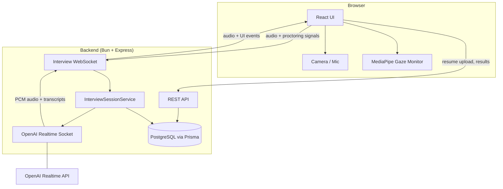
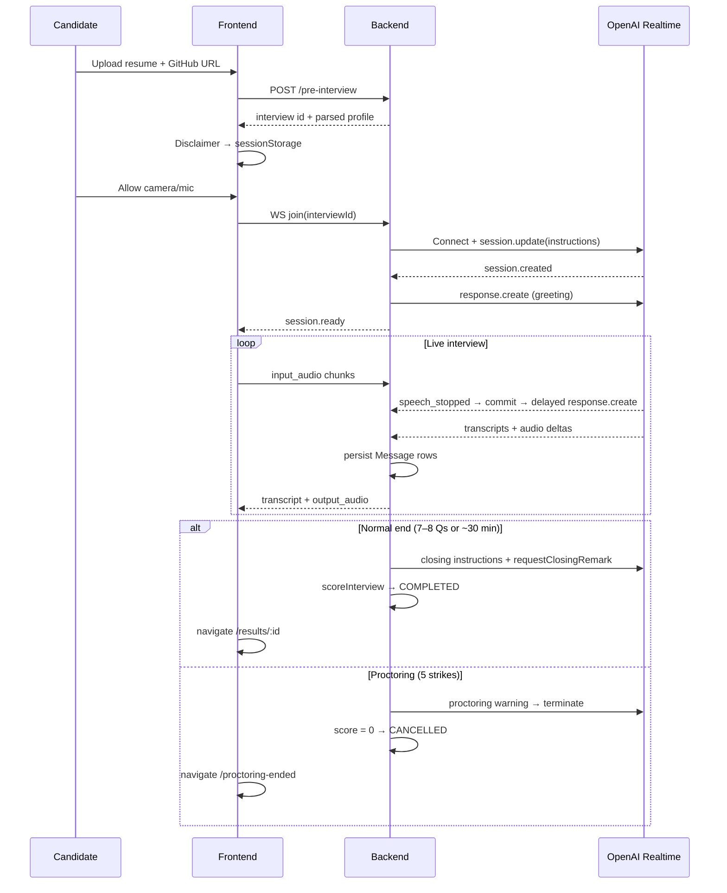

# AI Interviewer

A full-stack AI mock interview platform. Candidates upload a resume and GitHub profile, then complete a **live spoken interview** with an OpenAI Realtime agent. Sessions are **proctored** (camera, gaze, tab focus, copy/paste), **transcribed in English**, **scored**, and **persisted** to PostgreSQL.

Built as a **Bun monorepo** with a layered backend, feature-oriented frontend, and shared API types.

---

## Table of contents

- [High-level architecture](#high-level-architecture)
- [Repository structure](#repository-structure)
- [Backend architecture](#backend-architecture)
- [Frontend architecture](#frontend-architecture)
- [Shared packages](#shared-packages)
- [Data model](#data-model)
- [API & WebSocket protocol](#api--websocket-protocol)
- [Interview flow](#interview-flow)
- [Proctoring](#proctoring)
- [Design decisions & trade-offs](#design-decisions--trade-offs)
- [Getting started](#getting-started)
- [Environment variables](#environment-variables)
- [Scripts](#scripts)

---

## High-level architecture

The system uses a **sideband WebSocket** pattern: the browser never talks to OpenAI directly. All realtime traffic flows through the backend, which can moderate, score, persist transcripts, and enforce proctoring.



**Why sideband (browser → backend → OpenAI)?**

| Approach | Pros | Cons |
|----------|------|------|
| **Direct browser → OpenAI** | Lower latency, simpler | No server-side moderation, scoring, or cheat enforcement; API key exposed |
| **Sideband (chosen)** | Full control, persistence, proctoring, secret key on server | Extra hop, more code to maintain |

---

## Repository structure

```
ai-interviewer/
├── apps/
│   ├── backend/          # Express + WebSocket + Prisma + OpenAI Realtime
│   └── frontend/         # React 19 + Bun dev server + Tailwind + MediaPipe
├── packages/
│   ├── api-types/        # Shared TypeScript contracts (REST + WebSocket)
│   └── typescript-config/# Shared tsconfig base (used by api-types)
├── package.json          # Workspace root (Turborepo + Bun workspaces)
└── turbo.json            # Task orchestration (dev, build, lint)
```

---

## Backend architecture

The backend follows a **layered / clean architecture** inspired by enterprise patterns. Dependencies point inward: `api` → `application` → `domain`, with `infrastructure` implementing I/O.

```
apps/backend/
├── index.ts                          # Entry: loads dotenv, starts server
├── prisma/
│   ├── schema.prisma                 # Interview + Message models
│   └── migrations/                   # SQL migration history
├── lib/generated/prisma/             # Prisma client output (generated, do not edit)
└── src/
    ├── server.ts                     # Creates HTTP server, attaches WebSocket
    ├── config/
    │   └── env.ts                      # Typed env accessors
    ├── api/http/
    │   ├── app.ts                      # Express app factory (CORS, JSON, routes)
    │   ├── middleware/
    │   │   └── upload.middleware.ts    # Multer config for resume uploads (5 MB)
    │   └── routes/
    │       ├── pre-interview.routes.ts # POST /api/v1/pre-interview
    │       └── interview-results.routes.ts  # GET /api/v1/interview/:id/results
    ├── application/
    │   ├── pre-interview/
    │   │   └── pre-interview.service.ts    # Parse resume + GitHub → create interview
    │   └── interview/
    │       ├── interview-session.service.ts # Core realtime session orchestrator
    │       └── interview-results.service.ts # Fetch completed interview results
    ├── domain/
    │   ├── interview/
    │   │   ├── interview-instructions.ts   # System prompt for OpenAI agent
    │   │   └── interview-limits.ts           # Pacing: 7–8 Qs, ~30 min
    │   ├── moderation/
    │   │   └── moderation.service.ts       # Prompt-injection filter + scoring heuristic
    │   ├── proctoring/
    │   │   └── proctoring.messages.ts      # Strike limits, agent/toast copy
    │   └── resume/
    │       └── extract-resume-fields.ts    # Heuristic resume section parser
    └── infrastructure/
        ├── db/
        │   ├── prisma.client.ts            # Prisma + pg adapter singleton
        │   └── repositories/
        │       ├── interview.repository.ts
        │       └── message.repository.ts
        ├── github/
        │   └── github.client.ts            # GitHub REST API (repos list)
        ├── openai/
        │   └── realtime-socket.ts          # OpenAI Realtime WebSocket client
        ├── resume/
        │   └── resume.parser.ts            # PDF / DOCX / TXT text extraction
        └── websocket/
            └── interview-ws.server.ts      # /api/v1/interview/ws handler
```

### What each backend layer does

| Layer | Responsibility | Example |
|-------|----------------|---------|
| **config** | Environment configuration | `OPENAI_API_KEY`, `PORT` |
| **api** | HTTP transport, validation at the edge | Multer upload, route wiring |
| **application** | Use cases / orchestration | Start interview, end session, fetch results |
| **domain** | Pure business rules, no I/O | Interview pacing, moderation patterns, proctoring copy |
| **infrastructure** | External systems | Prisma, OpenAI WS, GitHub API, file parsing |

### Key backend files

| File | Purpose |
|------|---------|
| `index.ts` | Thin bootstrap — imports `dotenv`, calls `startServer()` |
| `interview-session.service.ts` | **Core orchestrator** per WebSocket connection: join, audio relay, transcripts, pacing, proctoring strikes, scoring, DB persistence |
| `realtime-socket.ts` | Wraps OpenAI Realtime API: session config, semantic VAD, English transcription, proctoring/closing prompts |
| `interview-instructions.ts` | Builds the agent system prompt from resume + GitHub JSON |
| `pre-interview.service.ts` | Parallel resume parse + GitHub fetch → `Interview` row |
| `interview.repository.ts` | CRUD for interview status transitions |
| `message.repository.ts` | Persists user/assistant transcript lines |

---

## Frontend architecture

The frontend uses a **feature + shared** layout. Page components live in `components/`; domain logic lives in `features/`; cross-cutting utilities live in `shared/`.

```
apps/frontend/
├── styles/globals.css              # Tailwind v4 theme + dark mode tokens
├── build.ts                        # Production static build (Bun)
└── src/
    ├── index.ts                    # Bun.serve dev server (HMR)
    ├── index.html                  # HTML shell → frontend.tsx
    ├── frontend.tsx                # React root mount
    ├── app/
    │   └── App.tsx                 # React Router routes
    ├── components/                 # Page-level UI + shadcn primitives
    │   ├── Form.tsx                # Resume upload + GitHub URL + disclaimer
    │   ├── Interview.tsx           # Media check → realtime connection → proctoring
    │   ├── InterviewRoom.tsx       # Live room: tiles, transcript, controls
    │   ├── MediaCheck.tsx          # Mandatory camera/mic consent + verification
    │   ├── ProctoringEnded.tsx     # Shown when interview ends due to violations
    │   ├── Result.tsx              # Post-interview score + transcript review
    │   └── ui/                     # shadcn/ui primitives (button, card, modal, …)
    ├── features/
    │   ├── pre-interview/constants/disclaimer.ts
    │   ├── interview/services/
    │   │   ├── realtime-interview.ts   # WebSocket client to backend
    │   │   └── audio-bridge.ts         # Mic capture + speaker playback (PCM16 24 kHz)
    │   └── proctoring/
    │       ├── constants.ts            # Gaze timing thresholds
    │       ├── hooks/use-proctoring.ts # Camera-off + gaze violation hook
    │       └── services/gaze-monitor.ts # MediaPipe Face Landmarker wrapper
    └── shared/
        ├── api/
        │   ├── config.ts           # BACKEND_URL (defaults to localhost:3001)
        │   └── types.ts            # Re-exports from @ai-interviewer/api-types
        ├── components/PageShell.tsx
        └── lib/
            ├── interview-session.ts    # sessionStorage: pre-interview profile
            ├── interview-end-state.ts  # sessionStorage: cheat end metadata
            ├── media-stream.ts       # Stop tracks on teardown
            └── utils.ts              # cn() — Tailwind class merge
```

### Routes

| Path | Component | When |
|------|-----------|------|
| `/` | `Form` | Upload resume, enter GitHub URL |
| `/interview/:id` | `Interview` | Media check → live interview |
| `/interview/:id/proctoring-ended` | `ProctoringEnded` | Terminated for proctoring violations |
| `/results/:id` | `Result` | Normal completion — score + transcript |

---

## Shared packages

### `packages/api-types`

Single source of truth for **REST response shapes** and **WebSocket message types** used by both apps.

```
packages/api-types/src/index.ts
```

Exports: `ParsedResume`, `PreInterviewResponse`, `InterviewResultsResponse`, `ClientInterviewMessage`, `ServerInterviewEvent`, `CheatSignal`, etc.

**Why a shared package instead of duplicating types?**

| Option | Verdict |
|--------|---------|
| Duplicate `types.ts` in frontend + backend | Drifts quickly; WS protocol bugs are silent |
| **Shared `@ai-interviewer/api-types` (chosen)** | One contract; TypeScript catches mismatches at compile time |
| OpenAPI + code generation | Heavier tooling; overkill for current scope |

### `packages/typescript-config`

Shared `tsconfig` base extended by `api-types`. Keeps compiler settings consistent across packages.

---

## Data model

```prisma
Interview {
  id, githubMetaData (Json), resume (Json)
  status: PENDING | IN_PROGRESS | COMPLETED | CANCELLED | FAILED
  score (Int), createdAt, updatedAt
  conversations → Message[]
}

Message {
  id, message, participant (User | Assistant)
  interviewId, createdAt
}
```

- **Resume** and **GitHub metadata** are stored as JSON blobs — flexible schema without migrations for every new parsed field.
- **Messages** are append-only transcript lines persisted during the live session.
- **Score** is computed at end-of-interview (0 on cheat/cancel).

---

## API & WebSocket protocol

### REST

| Method | Path | Description |
|--------|------|-------------|
| `POST` | `/api/v1/pre-interview` | Multipart: `resume` (PDF/DOCX/TXT) + `githubUrl` → creates interview |
| `GET` | `/api/v1/interview/:id/results` | Returns score, stats, full transcript (COMPLETED only) |

### WebSocket — `ws://host/api/v1/interview/ws`

**Client → server**

| Type | Payload | Purpose |
|------|---------|---------|
| `join` | `{ interviewId }` | Start session |
| `input_audio` | `{ audio: base64 PCM16 }` | Mic stream |
| `cheat_signal` | `{ signal: CheatSignal }` | Proctoring violation |
| `end_interview` | — | Candidate ends early |

**Server → client**

| Type | Purpose |
|------|---------|
| `session.ready` | OpenAI connected, agent will greet |
| `transcript` | Live user/agent text |
| `agent_speaking` / `user_speaking` | Turn indicators |
| `output_audio` | Agent PCM16 audio chunks |
| `proctoring.warning` | Toast + strike count |
| `interview.ended` | `{ reason, message, score? }` |
| `error` | Recoverable or fatal error |

Full types: `packages/api-types/src/index.ts`.

---

## Interview flow



### Pacing rules

- **Target:** ~7 questions, ~30 minutes
- **Hard stop:** 8 questions or ~35 minutes (grace for in-progress answers)
- Agent receives wind-down then closing instructions; speaks a warm goodbye before the session ends

### Turn-taking

OpenAI **semantic VAD** with `create_response: false` — the backend commits audio on `speech_stopped`, then waits **2 seconds** before calling `response.create`. This reduces the agent interrupting mid-thought.

---

## Proctoring

Violations share a **single 5-strike pool** across all signal types.

| Signal | Detected by | Strike timing |
|--------|-------------|---------------|
| `tab_hidden` | `visibilitychange` | Immediate on signal |
| `window_blur` | `window blur` | Immediate (2 s debounce) |
| `copy` / `paste` | clipboard events | Immediate |
| `face_not_visible` / `looking_away` | MediaPipe gaze monitor | Soft warning @ 3 s, strike @ 30 s |
| `camera_disabled` | Camera track off | Soft warning @ 3 s, strike @ 30 s |

On each strike: toast + agent speaks a firm reminder via `requestProctoringWarning()`.  
On strike 5: agent gives final message → `interview.ended` reason `cheat` → navigate to `/proctoring-ended`.

**Why client-side gaze + server-side enforcement?**

- Gaze needs video frames — must run in browser (MediaPipe).
- Strikes and termination are **authoritative on the server** so a modified client cannot ignore limits.
- Trade-off: sophisticated users could spoof WS messages; production would add signed tokens, rate limits, and recording review.

---

## Design decisions & trade-offs

### Runtime: Bun (not Node + Vite)

| Why Bun | Why not Node/Vite |
|---------|-------------------|
| Single toolchain for backend + frontend dev server | Larger config surface (webpack/vite + nodemon) |
| Native TypeScript, fast installs, built-in test runner | More mature ecosystem docs for Node |
| `Bun.serve` with HMR for React | Vite has richer plugin ecosystem |

### Monorepo: Turborepo + Bun workspaces

| Why | Trade-off |
|-----|-----------|
| Shared `@ai-interviewer/api-types` with zero publish step | Slightly more complex than two separate repos |
| `turbo run dev` runs both apps | Turbo cache/config overhead for a 2-app repo |

### Backend layering (not a flat `lib/` folder)

| Why layered | Why not flat |
|-------------|--------------|
| Clear boundaries: domain logic testable without DB/OpenAI | Faster to write initially |
| Easy to swap infrastructure (e.g. different LLM provider) | More folders |
| Matches how teams scale interview features | Overkill for a 500-line prototype |

We intentionally **did not** add DI containers, event buses, or microservices — the app is one deployable unit.

### OpenAI Realtime (not chat completions + TTS/STT pipeline)

| Why Realtime | Why not STT → GPT → TTS |
|--------------|-------------------------|
| Natural turn-taking, low latency voice | More control over each step |
| Single WebSocket session | Cheaper models per step, easier to swap STT vendor |
| Built-in transcription | More moving parts to maintain |

Trade-off: tied to OpenAI's Realtime API pricing and behavior.

### Resume parsing: heuristic extractor (not LLM)

| Why heuristic | Why not LLM parse |
|---------------|-------------------|
| Fast, free, deterministic on upload | Better accuracy on messy PDFs |
| Good enough for structured resumes | Extra API call + latency on every upload |

### Scoring: simple heuristic (not LLM judge)

Current score (0–100) uses exchange count, answer depth (char length), and balance.  
**Why:** cheap, instant, no extra API call.  
**Trade-off:** not semantically meaningful — replace with rubric-based LLM evaluation when quality matters.

### PostgreSQL + Prisma JSON columns

| Why JSON for resume/github | Why not normalized tables |
|----------------------------|---------------------------|
| Parsed shape evolves without migrations | Harder to query across candidates |
| Read once per interview session | No SQL analytics on skills yet |

### Frontend: components in `components/`, logic in `features/`

Page components remain in `components/` for now; services/hooks live in `features/`.  
**Future:** move `Form.tsx`, `Interview.tsx`, etc. into `features/*/components/` for full colocation.

---

## Getting started

### Prerequisites

- [Bun](https://bun.sh) ≥ 1.3
- PostgreSQL database
- OpenAI API key with Realtime access

### Setup

```bash
# Clone and install
git clone <repo-url>
cd ai-interviewer
bun install

# Backend env
cp apps/backend/.env.example apps/backend/.env
# Edit .env: DATABASE_URL, OPENAI_API_KEY, optional GITHUB_TOKEN

# Database
cd apps/backend
bunx prisma migrate dev
bunx prisma generate

# Run both apps (from repo root)
cd ../..
bun run dev
```

- **Frontend:** http://localhost:3000 (Bun default; check terminal output)
- **Backend:** http://localhost:3001
- **WebSocket:** ws://localhost:3001/api/v1/interview/ws

### Production build (frontend)

```bash
cd apps/frontend
bun run build   # outputs to dist/
bun run start
```

---

## Environment variables

### Backend (`apps/backend/.env`)

| Variable | Required | Description |
|----------|----------|-------------|
| `DATABASE_URL` | Yes | PostgreSQL connection string |
| `OPENAI_API_KEY` | Yes | OpenAI API key |
| `PORT` | No | Default `3001` |
| `OPENAI_REALTIME_MODEL` | No | Default `gpt-realtime-2` |
| `OPENAI_REALTIME_VOICE` | No | Default `marin` |
| `GITHUB_TOKEN` | No | Raises GitHub API rate limits |
| `PROXY_URL` | No | HTTP proxy for GitHub API |

### Frontend

Backend URL defaults to `http://localhost:3001`. Override at build time if needed:

```ts
// apps/frontend/build.ts — define block
"import.meta.env.VITE_BACKEND_URL": JSON.stringify(process.env.BACKEND_URL ?? "http://localhost:3001")
```

---

## Scripts

| Command | Where | Description |
|---------|-------|-------------|
| `bun run dev` | root | Start backend + frontend via Turbo |
| `bun run build` | root | Build all apps |
| `bun run dev` | `apps/backend` | Backend with hot reload |
| `bun run dev` | `apps/frontend` | Frontend with HMR |
| `bunx prisma migrate dev` | `apps/backend` | Apply migrations |
| `bunx prisma generate` | `apps/backend` | Regenerate Prisma client → `lib/generated/prisma` |

---

## License

Private project — add a license if open-sourcing.
