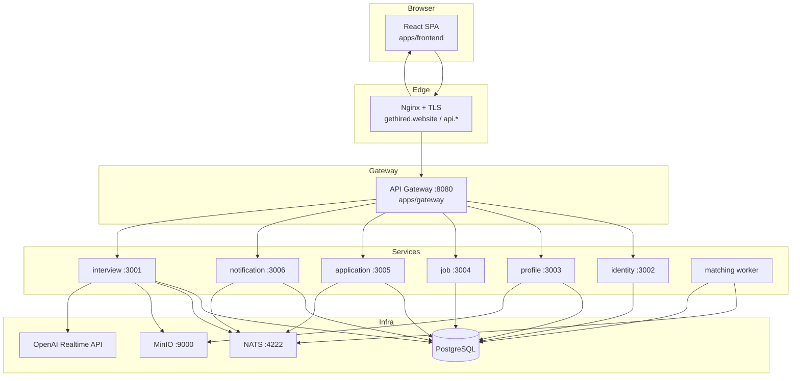
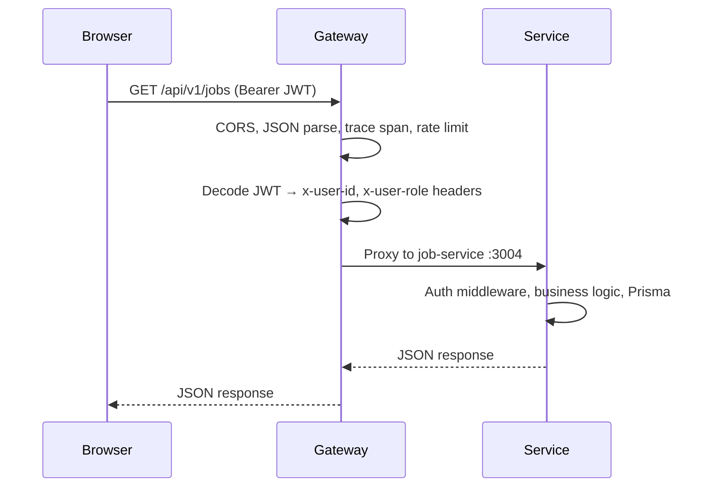
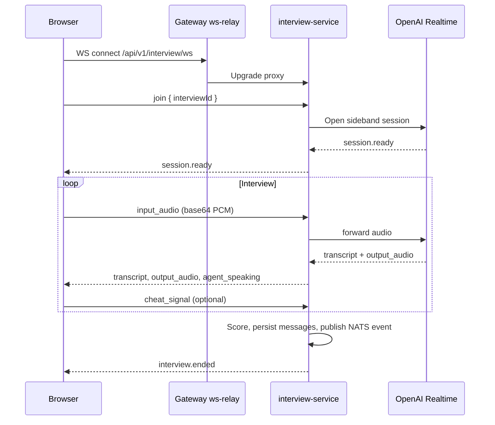
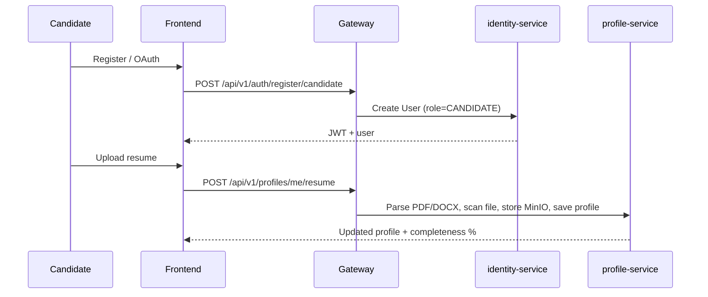
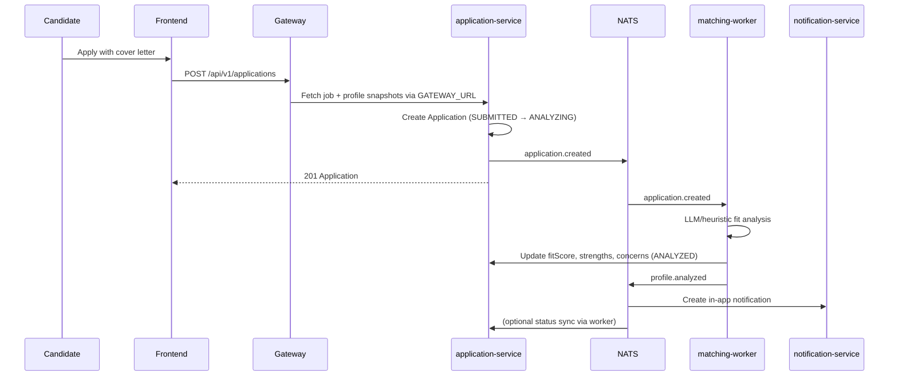
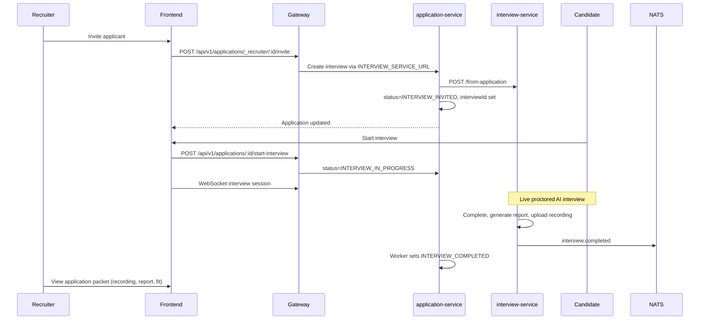
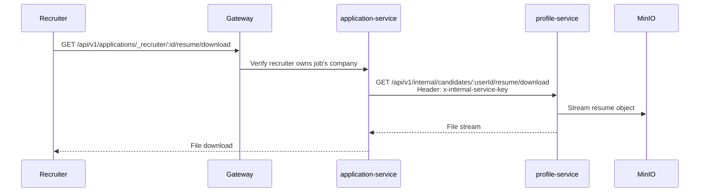

# GetHired — AI Interview Platform

A full-stack hiring platform where **candidates** build profiles, apply to jobs, and complete **live AI-proctored interviews**; **recruiters** post jobs, review AI fit analysis, invite candidates, and make hiring decisions.

Built as a **Bun + Turborepo monorepo** with microservices, an API gateway, NATS event bus, PostgreSQL (database-per-service), and MinIO object storage.

**Production domain:** [gethired.website](https://gethired.website) · **API:** `api.gethired.website` · **Deploy guide:** [docs/DEPLOY-ORACLE.md](docs/DEPLOY-ORACLE.md)

---

## Table of contents

1. [Platform overview](#platform-overview)
2. [Architecture](#architecture)
3. [End-to-end flows](#end-to-end-flows)
4. [Application status lifecycle](#application-status-lifecycle)
5. [Design decisions & trade-offs](#design-decisions--trade-offs)
6. [Technology stack](#technology-stack)
7. [Gateway routing](#gateway-routing)
8. [REST API reference](#rest-api-reference)
9. [WebSocket interview protocol](#websocket-interview-protocol)
10. [NATS events](#nats-events)
11. [Data model](#data-model)
12. [Environment variables](#environment-variables)
13. [Local development](#local-development)
14. [Deployment](#deployment)
15. [Repository file reference](#repository-file-reference)
    - [Prisma migrations](#prisma-migrations-sql-history)
    - [Complete file tree](#complete-file-tree-source-only)

---

## Platform overview

| Role | Capabilities |
|------|--------------|
| **Candidate** | Register/login (email or OAuth), upload resume & photo, enrich GitHub profile, browse jobs, apply with cover letter, view AI fit analysis, take proctored AI interview, see results |
| **Recruiter** | Register with company, create/edit/publish jobs (AI-assisted JD), view applicants per job, see fit scores & snapshots, download resume, invite to interview, review interview recording/snapshots/report, mark selected |
| **Public** | Landing page, public job detail pages (shareable links) |

**Core services (7):** identity, profile, job, application, interview, notification, matching (worker)

**Shared infrastructure:** PostgreSQL, NATS JetStream, MinIO, optional Jaeger (OpenTelemetry)

---

## Architecture

### System context



### Request path (HTTP)

Every browser API call goes to **one origin** (`BACKEND_URL` / gateway). The gateway proxies by path prefix, attaches tracing, rate-limits, and forwards JWT context.



### Interview realtime path (sideband WebSocket)

The browser **never** talks to OpenAI directly. Audio flows: Browser ↔ Gateway WS relay ↔ interview-service ↔ OpenAI Realtime.



### Service ownership (database-per-service)

| Service | Port | Database | Owns |
|---------|------|----------|------|
| `interview-service` | 3001 | `interview` schema/DB | Interviews, messages, reports, proctoring assets |
| `identity-service` | 3002 | `identity` | Users, companies, OAuth accounts, recruiter profiles |
| `profile-service` | 3003 | `profile` | Candidate profiles, resume/photo in MinIO |
| `job-service` | 3004 | `jobs` | Job postings |
| `application-service` | 3005 | `applications` | Applications, fit analysis fields, audit log |
| `notification-service` | 3006 | `notifications` | In-app notifications (+ optional email) |
| `matching-service` | — (worker) | reads `applications` DB | Async AI fit analysis on `application.created` |
| `gateway` | 8080 | none | Reverse proxy, rate limits, WS relay |

Each service has its own Prisma schema, migrations under `prisma/migrations/`, and generated client under `lib/generated/prisma/` (do not edit).

---

## End-to-end flows

### 1. Candidate onboarding



### 2. Apply to job → AI matching



### 3. Recruiter invites → interview → completion



### 4. Recruiter resume download (internal chain)



---

## Application status lifecycle

```
SUBMITTED → ANALYZING → ANALYZED → INTERVIEW_INVITED → INTERVIEW_PENDING
    → INTERVIEW_IN_PROGRESS → INTERVIEW_COMPLETED → SELECTED
                                    ↘ INTERVIEW_CANCELLED
```

| Status | Meaning |
|--------|---------|
| `SUBMITTED` | Application record created |
| `ANALYZING` | Matching worker processing |
| `ANALYZED` | Fit score & summary available |
| `INTERVIEW_INVITED` | Recruiter sent invite; `interviewId` set |
| `INTERVIEW_PENDING` | Candidate has not started |
| `INTERVIEW_IN_PROGRESS` | Active WebSocket session |
| `INTERVIEW_COMPLETED` | Interview ended normally; report available |
| `INTERVIEW_CANCELLED` | Ended early (cheat, error, cancel) |
| `SELECTED` | Recruiter hiring decision |

---

## Design decisions & trade-offs

| Decision | Rationale | Trade-off |
|----------|-----------|-----------|
| **Microservices + DB-per-service** | Independent deploy, clear ownership, scales with team | More ops complexity; cross-service reads need snapshots or internal APIs |
| **API gateway (single entry)** | One CORS origin, centralized rate limits & tracing | Extra network hop; gateway must stay highly available |
| **Sideband WebSocket (not direct OpenAI)** | Hides API key, enables moderation, scoring, persistence, proctoring enforcement | Higher latency vs direct; more server code |
| **Job/candidate snapshots on apply** | Deterministic matching even if job/profile changes later | Larger rows; snapshots can become stale for display |
| **NATS + idempotent workers** | Decoupled matching & notifications; replay-safe | Requires `ProcessedEvent` dedup table per consumer |
| **MinIO (S3-compatible)** | Cheap local dev; same API as production object storage | Self-hosted durability vs managed S3 |
| **Bun runtime** | Fast installs, native TS, unified tooling | Smaller ecosystem than Node for some libraries |
| **Shared `@ai-interviewer/api-types`** | Single source of truth for REST + WS contracts | Must version carefully across services |
| **Internal service key** | Service-to-service calls without user JWT | Shared secret rotation; must match across services |
| **Monorepo (Turborepo)** | Atomic cross-package changes, shared types | Large repo; CI must be selective |

---

## Technology stack

| Layer | Choices |
|-------|---------|
| Runtime | Bun 1.3+ |
| Monorepo | Turborepo workspaces (`apps/*`, `services/*`, `packages/*`) |
| Frontend | React 19, React Router 7, Tailwind CSS, shadcn/ui, Aceternity motion, MediaPipe (gaze) |
| Backend | Express 5, Prisma 6, `http-proxy-middleware` |
| AI | OpenAI Realtime API (voice interview), GPT (JD generation, fit analysis, reports) |
| Messaging | NATS JetStream |
| Storage | PostgreSQL 16, MinIO |
| Observability | OpenTelemetry → Jaeger (optional) |
| Auth | JWT (7d), Google/GitHub OAuth |

---

## Gateway routing

Defined in `apps/gateway/src/app.ts`. All paths are prefixed with `/api/v1` unless noted.

| Path prefix | Target service | Rate limit |
|-------------|----------------|------------|
| `/api/v1/auth` | identity-service | 20/min (auth) |
| `/api/v1/companies` | identity-service | 300/min |
| `/api/v1/profiles` | profile-service | 300/min; uploads 30/min |
| `/api/v1/jobs` | job-service | 300/min |
| `/api/v1/applications` | application-service | 300/min |
| `/api/v1/notifications` | notification-service | 300/min |
| `/api/*` (remainder) | interview-service | 300/min; recording/snapshot uploads 30/min |
| `/health` | gateway itself | — |
| `WS /api/v1/interview/ws` | interview-service (via `ws-relay.ts`) | — |

Gateway forwards JWT claims as headers (`x-user-id`, `x-user-role`, `x-company-id`) for downstream auth middleware.

---

## REST API reference

Base URL: `http://localhost:8080` (dev) or `https://api.gethired.website` (prod).  
Authenticated routes require `Authorization: Bearer <jwt>`.

### Identity (`/api/v1/auth`, `/api/v1/companies`)

| Method | Path | Auth | Description |
|--------|------|------|-------------|
| GET | `/auth/providers` | — | List enabled OAuth providers |
| POST | `/auth/register/candidate` | — | Email/password candidate signup |
| POST | `/auth/register/recruiter` | — | Recruiter signup + company creation |
| POST | `/auth/login` | — | Email/password login |
| GET | `/auth/me` | JWT | Current user |
| GET | `/auth/oauth/:provider` | — | Start OAuth (google, github) |
| GET | `/auth/oauth/:provider/callback` | — | OAuth callback → redirect to frontend with token |
| GET | `/companies` | — | List companies (public) |

### Profile (`/api/v1/profiles`)

| Method | Path | Auth | Description |
|--------|------|------|-------------|
| GET | `/profiles/me` | JWT (candidate) | Get own profile |
| PATCH | `/profiles/me` | JWT (candidate) | Update profile fields |
| POST | `/profiles/me/resume` | JWT | Upload resume (multipart `resume`) |
| POST | `/profiles/me/photo` | JWT | Upload profile photo |
| GET | `/profiles/me/resume/download` | JWT | Download own resume |
| POST | `/profiles/me/github/enrich` | JWT | Fetch GitHub metadata into profile |

**Internal (profile-service only, not via gateway):**

| Method | Path | Auth | Description |
|--------|------|------|-------------|
| GET | `/api/v1/internal/candidates/:userId/resume/download` | `x-internal-service-key` | Resume stream for application-service |

### Jobs (`/api/v1/jobs`)

| Method | Path | Auth | Description |
|--------|------|------|-------------|
| GET | `/jobs` | — | Public job list (filters: status, search) |
| GET | `/jobs/:id` | — | Public job detail |
| GET | `/jobs/_candidate/recommended` | JWT (candidate) | Personalized recommendations |
| GET | `/jobs/_recruiter/mine` | JWT (recruiter) | Recruiter's company jobs |
| POST | `/jobs/_recruiter/generate-description` | JWT (recruiter) | AI job description draft |
| POST | `/jobs` | JWT (recruiter) | Create job |
| PATCH | `/jobs/:id` | JWT (recruiter) | Update job |

### Applications (`/api/v1/applications`)

| Method | Path | Auth | Description |
|--------|------|------|-------------|
| POST | `/applications` | JWT (candidate) | Apply to job |
| GET | `/applications/me` | JWT (candidate) | List own applications |
| GET | `/applications/me/dashboard` | JWT (candidate) | Dashboard stats |
| GET | `/applications/me/by-interview/:interviewId` | JWT (candidate) | Lookup by interview |
| GET | `/applications/:id` | JWT (candidate) | Application detail + analysis |
| POST | `/applications/:id/start-interview` | JWT (candidate) | Transition to in-progress |
| GET | `/applications/_recruiter/job/:jobId` | JWT (recruiter) | Applicants for job |
| GET | `/applications/_recruiter/company/dashboard` | JWT (recruiter) | Recruiter dashboard stats |
| GET | `/applications/_recruiter/:id` | JWT (recruiter) | Full application packet |
| POST | `/applications/_recruiter/:id/invite` | JWT (recruiter) | Invite to AI interview |
| PATCH | `/applications/_recruiter/:id/decision` | JWT (recruiter) | Mark selected/rejected |
| GET | `/applications/_recruiter/:id/resume/download` | JWT (recruiter) | Proxy resume download |

**Internal:**

| Method | Path | Auth | Description |
|--------|------|------|-------------|
| POST | `/api/v1/internal/tenant-audit` | `x-internal-service-key` | Append audit log entry |

### Notifications (`/api/v1/notifications`)

| Method | Path | Auth | Description |
|--------|------|------|-------------|
| GET | `/notifications/me` | JWT | List notifications for user |

### Interview (`/api/v1/interview`, `/api/v1/interviews`)

| Method | Path | Auth | Description |
|--------|------|------|-------------|
| POST | `/interviews/from-application` | Internal/service | Create interview from application context |
| GET | `/interview/:id/feedback` | JWT | Pre-interview briefing (resume, github) |
| POST | `/interview/:id/recording` | JWT | Upload session recording (multipart) |
| POST | `/interview/:id/proctoring-snapshot` | JWT | Upload proctoring snapshot image |
| GET | `/interview/:id/results` | JWT | Post-interview results & report |

### Health

| Method | Path | Description |
|--------|------|-------------|
| GET | `/health` | Gateway liveness |

Each service also exposes its own `/health` on its direct port (not proxied by default).

---

## WebSocket interview protocol

**Endpoint:** `ws://localhost:8080/api/v1/interview/ws` (proxied to interview-service)

Types live in `packages/api-types/src/index.ts`.

### Client → server

| type | Payload | Purpose |
|------|---------|---------|
| `join` | `{ interviewId }` | Attach to session |
| `input_audio` | `{ audio: base64 }` | PCM audio chunk |
| `cheat_signal` | `{ signal }` | Proctoring violation |
| `end_interview` | — | Graceful end |

**Cheat signals:** `tab_hidden`, `window_blur`, `copy`, `paste`, `face_not_visible`, `looking_away`, `camera_disabled`

### Server → client

| type | Purpose |
|------|---------|
| `session.ready` | OpenAI session established |
| `transcript` | Partial/final speech-to-text |
| `agent_speaking` / `user_speaking` | VAD indicators |
| `output_audio` | Agent TTS audio |
| `proctoring.warning` | Strike count toward termination |
| `interview.ended` | Terminal state with reason & score |
| `error` | Fatal session error |

---

## NATS events

Subjects defined in `packages/api-types/src/events.ts`:

| Subject | Publisher | Consumers | Purpose |
|---------|-----------|-----------|---------|
| `application.created` | application-service | matching-worker | Trigger fit analysis |
| `profile.analyzed` | matching-worker | notification-service | Notify candidate analysis ready |
| `application.invited` | application-service | notification-service | Interview invite notification |
| `interview.started` | interview-service | application-service | Status → IN_PROGRESS |
| `interview.completed` | interview-service | application-service, notification-service | Status → COMPLETED |
| `interview.cancelled` | interview-service | application-service | Status → CANCELLED |

All events include `eventId`, `correlationId`, `timestamp` for idempotent processing (`ProcessedEvent` table).

---

## Data model

### identity-service

- **Company** — `id`, `name`, `slug`, `logoUrl`
- **User** — `email`, `passwordHash?`, `role` (CANDIDATE | RECRUITER), `companyId?`
- **OAuthAccount** — linked Google/GitHub accounts
- **RecruiterProfile** — `title`, `department` per recruiter user

### profile-service

- **CandidateProfile** — `userId` PK, skills/experience/education JSON, resume & photo MinIO keys, `parsedResume`, `githubMeta`, `profileCompleteness`

### job-service

- **Job** — `companyId`, `title`, `description`, skills arrays, salary, `workStyle`, `employmentTypes`, `status` (DRAFT | OPEN | CLOSED), `expiresAt`

### application-service

- **Application** — `jobId`, `companyId`, `candidateUserId`, `status`, `jobSnapshot`, `candidateSnapshot`, fit fields (`fitScore`, `strengths`, `concerns`), `interviewId`, timestamps
- **ProcessedEvent** — idempotency for NATS consumers
- **TenantAuditLog** — recruiter actions per company

### interview-service

- **Interview** — `applicationId?`, context JSON, `status`, `score`, timestamps
- **Message** — conversation transcript (`User` | `Assistant`)
- **InterviewReport** — narrative, recommendation, dimension scores
- **ProctoringAsset** — `SNAPSHOT` | `RECORDING` in MinIO

### notification-service

- **Notification** — per-user in-app messages with optional `linkUrl`
- **ProcessedEvent** — idempotency

### matching-service

Reads/writes **Application** rows in the applications database (same schema as application-service; see `matching-service/prisma/README.md`).

---

## Environment variables

Copy each service's `.env.example` to `.env`. Critical cross-service values **must match**:

| Variable | Services | Purpose |
|----------|----------|---------|
| `JWT_SECRET` | gateway, identity, profile, job, application, notification, interview | Sign/verify user JWTs |
| `INTERNAL_SERVICE_KEY` | application, profile, job | Service-to-service auth |
| `DATABASE_URL` | each service | Own Postgres database |
| `NATS_URL` | identity, application, interview, notification, matching | Event bus (`nats://localhost:4222`) |
| `FRONTEND_URL` | identity, application, notification | OAuth redirects & notification links |
| `GATEWAY_URL` | application, job | Inter-service HTTP via gateway |
| `OAUTH_CALLBACK_BASE_URL` | identity | `https://api.gethired.website/api/v1/auth/oauth` in prod |

### Per-service reference

#### Root / frontend

| Variable | Default | Description |
|----------|---------|-------------|
| `BACKEND_URL` | `http://localhost:8080` | API base (frontend `shared/api/config.ts`) |
| `NODE_ENV` | `development` | Build mode |

#### gateway (`apps/gateway/.env.example`)

| Variable | Default | Description |
|----------|---------|-------------|
| `PORT` | `8080` | Listen port |
| `INTERVIEW_SERVICE_URL` | `http://localhost:3001` | Upstream |
| `IDENTITY_SERVICE_URL` | `http://localhost:3002` | Upstream |
| `PROFILE_SERVICE_URL` | `http://localhost:3003` | Upstream |
| `JOB_SERVICE_URL` | `http://localhost:3004` | Upstream |
| `APPLICATION_SERVICE_URL` | `http://localhost:3005` | Upstream |
| `NOTIFICATION_SERVICE_URL` | `http://localhost:3006` | Upstream |
| `JWT_SECRET` | — | Decode Bearer tokens |
| `OTEL_EXPORTER_OTLP_ENDPOINT` | optional | Jaeger tracing |

#### identity-service

| Variable | Description |
|----------|-------------|
| `PORT` | `3002` |
| `DATABASE_URL` | Identity DB |
| `JWT_SECRET`, `JWT_EXPIRES_IN` | Token signing |
| `FRONTEND_URL` | Post-OAuth redirect target |
| `OAUTH_CALLBACK_BASE_URL` | OAuth redirect URI base |
| `GOOGLE_CLIENT_ID/SECRET`, `GITHUB_CLIENT_ID/SECRET` | OAuth credentials |
| `NATS_URL` | Event publishing |

#### profile-service

| Variable | Description |
|----------|-------------|
| `PORT` | `3003` |
| `DATABASE_URL` | Profile DB |
| `JWT_SECRET` | Auth |
| `MINIO_*` | Resume/photo object storage |
| `INTERNAL_SERVICE_KEY` | Internal resume download route |
| `GITHUB_TOKEN`, `PROXY_URL` | Optional GitHub API |

#### job-service

| Variable | Description |
|----------|-------------|
| `PORT` | `3004` |
| `DATABASE_URL` | Jobs DB |
| `JWT_SECRET` | Auth |
| `GATEWAY_URL` | Fetch profile/applications for recommendations |
| `APPLICATION_SERVICE_URL` | Direct audit log writes |
| `INTERNAL_SERVICE_KEY` | Audit API |
| `OPENAI_API_KEY` | Optional AI job descriptions |

#### application-service

| Variable | Description |
|----------|-------------|
| `PORT` | `3005` |
| `DATABASE_URL` | Applications DB |
| `JWT_SECRET` | Auth |
| `NATS_URL` | Publish/subscribe lifecycle events |
| `GATEWAY_URL` | Snapshot job/profile on apply |
| `INTERVIEW_SERVICE_URL`, `PROFILE_SERVICE_URL` | Invite & resume flows |
| `FRONTEND_URL` | Notification deep links |
| `INTERNAL_SERVICE_KEY` | Receive audit posts |

#### interview-service

| Variable | Description |
|----------|-------------|
| `PORT` | `3001` |
| `DATABASE_URL` | Interview DB |
| `OPENAI_API_KEY` | Realtime + report generation |
| `OPENAI_REALTIME_MODEL`, `OPENAI_REALTIME_VOICE` | Optional tuning |
| `NATS_URL` | Lifecycle events |
| `MINIO_*` | Recordings & snapshots |
| `GITHUB_TOKEN`, `PROXY_URL` | Optional enrichment |

#### notification-service

| Variable | Description |
|----------|-------------|
| `PORT` | `3006` |
| `DATABASE_URL` | Notifications DB |
| `JWT_SECRET` | Auth |
| `NATS_URL` | Event consumer |
| `FRONTEND_URL` | Link URLs in notifications |
| `RESEND_API_KEY`, `EMAIL_FROM` | Optional transactional email |

#### matching-service (worker)

| Variable | Description |
|----------|-------------|
| `DATABASE_URL` | Applications DB (shared) |
| `NATS_URL` | Subscribe to `application.created` |
| `OPENAI_API_KEY` | Fit analysis LLM calls |

#### Docker Compose (`docker-compose.yml`)

| Service | Ports | Credentials |
|---------|-------|-------------|
| postgres | `5433→5432` | `platform` / `platform` |
| nats | `4222`, `8222` | — |
| minio | `9000`, `9001` | `minio` / `minio123` |
| jaeger | `4318`, `16686` | — |

---

## Local development

### Prerequisites

- Bun ≥ 1.3.14
- Docker (for Postgres, NATS, MinIO, Jaeger)

### Quick start

```bash
# 1. Install dependencies
bun install

# 2. Start infrastructure
docker compose up -d

# 3. Copy env files (each service)
cp apps/gateway/.env.example apps/gateway/.env
cp services/identity-service/.env.example services/identity-service/.env
# ... repeat for each service

# 4. Run migrations (per service)
cd services/identity-service && bunx prisma migrate deploy && cd ../..
# ... repeat for profile, job, application, interview, notification, matching

# 5. Start all apps (Turborepo)
bun run dev
```

| Process | URL |
|---------|-----|
| Frontend | http://localhost:3000 (or Bun dev port) |
| Gateway | http://localhost:8080 |
| MinIO console | http://localhost:9001 |
| Jaeger UI | http://localhost:16686 |

### Root scripts

| Script | Command | Description |
|--------|---------|-------------|
| `dev` | `turbo run dev` | Start all workspace dev servers |
| `build` | `turbo run build` | Production builds |
| `check-types` | `turbo run check-types` | TypeScript across monorepo |
| `lint` | `turbo run lint` | Lint all packages |
| `test:e2e` | `bun test tests/e2e` | Critical flow integration tests |
| `format` | `prettier --write` | Format TS/TSX/MD |

---

## Deployment

Full Oracle Cloud Always Free guide: **[docs/DEPLOY-ORACLE.md](docs/DEPLOY-ORACLE.md)**

Production checklist:

- `FRONTEND_URL=https://gethired.website`
- `GATEWAY_URL` / `BACKEND_URL=https://api.gethired.website`
- `OAUTH_CALLBACK_BASE_URL=https://api.gethired.website/api/v1/auth/oauth`
- Nginx TLS termination for both hosts
- PM2 or systemd for Bun processes
- Same `JWT_SECRET` and `INTERNAL_SERVICE_KEY` everywhere

Additional docs: `docs/PHASE0.md` (migration notes), `docs/PHASE8.md` (hardening), `plan.md` (product roadmap).

---

## Repository file reference

Complete inventory from `find .` (excluding `node_modules/`, `.git/`, `dist/`, `lib/generated/`). **~280 tracked source/config files** plus local cache artifacts listed below.

Every source file includes a short purpose statement. **Generated artifacts** are summarized at the end — regenerate with `prisma generate` / `bun install`, never edit by hand.

### Repository root

| File | Description |
|------|-------------|
| `.gitignore` | Monorepo ignore rules: `node_modules`, `.env*`, `.turbo`, `dist`, `.next`, coverage |
| `package.json` | Workspace root: Turborepo scripts, Bun workspaces config |
| `bun.lock` | Locked dependency versions for entire monorepo |
| `turbo.json` | Turborepo task graph: `dev`, `build`, `lint`, `check-types` |
| `docker-compose.yml` | Local Postgres, NATS, MinIO, Jaeger containers |
| `plan.md` | Product phases, requirements, and implementation roadmap |
| `README.md` | This document |
| `.turbo/cache/**` | Turborepo content-addressable build cache (`.tar.zst`, manifest/meta JSON) — safe to delete |
| `.turbo/preferences/tui.json` | Turborepo TUI preferences (local IDE state) |

### `docs/`

| File | Description |
|------|-------------|
| `DEPLOY-ORACLE.md` | End-to-end Oracle Cloud deployment: VM, Docker, Nginx, Certbot, PM2, env templates, GoDaddy DNS for gethired.website |
| `PHASE0.md` | Phase 0 migration notes (monolith → microservices) |
| `PHASE8.md` | Phase 8 hardening: observability, rate limits, audit, file security |

### `tests/`

| File | Description |
|------|-------------|
| `e2e/critical-flows.test.ts` | Integration tests for auth, jobs, applications, and interview happy paths |

### `scripts/`

| File | Description |
|------|-------------|
| `phase0-migrate-interview-service.sh` | One-time helper to migrate legacy interview data into interview-service DB |

---

### `apps/frontend/` — React SPA

| File | Description |
|------|-------------|
| `package.json` | Frontend deps: React 19, Router, Tailwind, MediaPipe, chart libs |
| `build.ts` | Bun production build script for static assets |
| `bunfig.toml` | Bun bundler configuration |
| `bun-env.d.ts` | Bun type augmentations |
| `components.json` | shadcn/ui component registry config |
| `tsconfig.json` | TypeScript paths (`@/` → `src/`) |
| `.gitignore` | Ignores `dist/`, `node_modules/` |
| `.turbo/turbo-build.log` | Last Turborepo build log for this package |
| `.turbo/turbo-check-types.log` | Last typecheck log for this package |

#### `apps/frontend/.cursor/rules/`

| File | Description |
|------|-------------|
| `use-bun-instead-of-node-vite-npm-pnpm.mdc` | Cursor AI rule: prefer Bun APIs (`bun test`, `bun install`, `Bun.serve`) over Node/npm/vite |

#### `apps/frontend/src/` entry

| File | Description |
|------|-------------|
| `index.html` | HTML shell; mounts React root |
| `index.ts` | Bun dev server entry |
| `frontend.tsx` | React DOM hydration entry |
| `logo.svg` | App logo asset |

#### `apps/frontend/src/app/`

| File | Description |
|------|-------------|
| `App.tsx` | Root router: public, candidate, recruiter, interview routes; auth guards |

#### `apps/frontend/src/components/` — core interview UI

| File | Description |
|------|-------------|
| `Interview.tsx` | Main interview room: WS session, recording upload, proctoring integration |
| `InterviewRoom.tsx` | Interview layout shell (video, controls, transcript panel) |
| `InterviewComplete.tsx` | Post-interview success screen |
| `ProctoringEnded.tsx` | Shown when session terminated for proctoring violations |
| `Result.tsx` | Interview results & AI report display |
| `MediaCheck.tsx` | Pre-interview camera/mic permission check |

#### `apps/frontend/src/components/ui/` — shadcn primitives

| File | Description |
|------|-------------|
| `button.tsx` | Styled button variants |
| `card.tsx` | Card container component |
| `input.tsx` | Text input field |
| `textarea.tsx` | Multiline input |
| `label.tsx` | Form label |
| `select.tsx` | Dropdown select |
| `modal.tsx` | Dialog/modal overlay |
| `popover.tsx` | Popover positioning |
| `calendar.tsx` | Date picker calendar grid |
| `date-picker.tsx` | Date input with calendar popover |

#### `apps/frontend/src/components/aceternity/` — motion/FX

| File | Description |
|------|-------------|
| `background-grid.tsx` | Animated dot/grid background for marketing pages |
| `fade-in.tsx` | Scroll fade-in animation wrapper |
| `glowing-card.tsx` | Card with hover glow effect |
| `spotlight.tsx` | Cursor-following spotlight effect |
| `in-view-fade.tsx` | Intersection-observer fade-in |

#### `apps/frontend/src/features/auth/`

| File | Description |
|------|-------------|
| `context/auth-context.tsx` | React context: user session, login/logout, token persistence |
| `components/ProtectedRoute.tsx` | Route guard by role (CANDIDATE / RECRUITER) |
| `components/OAuthButtons.tsx` | Google/GitHub OAuth launch buttons |
| `services/auth-api.ts` | HTTP client for `/api/v1/auth/*` |
| `pages/LandingPage.tsx` | Marketing landing page composition |
| `pages/LoginPage.tsx` | Email login form |
| `pages/RegisterPage.tsx` | Candidate/recruiter registration |
| `pages/OAuthCallbackPage.tsx` | Parses token from OAuth redirect URL |

**`features/auth/components/landing/`** — marketing sections

| File | Description |
|------|-------------|
| `landing-data.ts` | Static copy, stats, testimonials data |
| `LandingHero.tsx` | Hero section with CTA |
| `LandingStats.tsx` | Platform statistics band |
| `LandingFeatures.tsx` | Feature grid |
| `LandingHowItWorks.tsx` | Step-by-step explainer |
| `LandingProductDemo.tsx` | Product screenshot/mock demo |
| `LandingTestimonials.tsx` | Social proof quotes |
| `LandingAudience.tsx` | Candidate vs recruiter value props |
| `LandingFooter.tsx` | Footer links and branding |

#### `apps/frontend/src/features/candidate/`

| File | Description |
|------|-------------|
| `pages/DashboardPage.tsx` | Candidate home: application stats, quick links |
| `pages/ProfilePage.tsx` | Edit profile, resume, photo, GitHub enrich |
| `pages/JobsListPage.tsx` | Browse open jobs with filters |
| `pages/JobDetailPage.tsx` | Job detail + apply CTA (authenticated) |
| `pages/ApplicationsPage.tsx` | List of candidate's applications |
| `pages/ApplicationAnalyticsPage.tsx` | Per-application fit analysis & pipeline |
| `components/ProfilePhotoUpload.tsx` | Photo upload widget with preview |
| `services/profile-api.ts` | HTTP client for `/api/v1/profiles/*` |

#### `apps/frontend/src/features/recruiter/`

| File | Description |
|------|-------------|
| `pages/DashboardPage.tsx` | Recruiter KPIs: open jobs, applicants, pipeline |
| `pages/JobsListPage.tsx` | Company's job postings table |
| `pages/JobEditPage.tsx` | Create/edit job form with AI description |
| `pages/JobApplicantsPage.tsx` | Applicants list for a job |
| `pages/ApplicationPacketPage.tsx` | Full review: fit, interview, recording, report |
| `components/ApplicantOverviewCard.tsx` | Applicant summary header card |
| `components/ApplicationFitAnalysisCard.tsx` | AI fit score breakdown |
| `components/InterviewAnalysisCard.tsx` | Interview dimension scores |
| `components/InterviewScoreHighlight.tsx` | Large score display |
| `components/InterviewReviewModal.tsx` | Modal for recording/snapshot review |
| `components/InterviewReviewPanel.tsx` | Side panel with media timeline |
| `components/RecruiterApplicationActions.tsx` | Invite, select, download actions |

#### `apps/frontend/src/features/jobs/`

| File | Description |
|------|-------------|
| `pages/PublicJobDetailPage.tsx` | Shareable public job page (no auth required) |
| `components/JobDescriptionGenerator.tsx` | AI-assisted JD generation UI |
| `components/JobFilters.tsx` | Search/filter controls for job list |
| `components/JobShareButtons.tsx` | Copy link / social share |
| `components/MatchScoreBadge.tsx` | Colored badge for fit percentage |
| `lib/job-filters.ts` | Client-side filter logic |
| `lib/job-share.ts` | Share URL builders |
| `lib/job-status-labels.ts` | Human labels for DRAFT/OPEN/CLOSED |
| `services/job-api.ts` | HTTP client for `/api/v1/jobs/*` |

#### `apps/frontend/src/features/applications/`

| File | Description |
|------|-------------|
| `services/application-api.ts` | HTTP client for `/api/v1/applications/*` |
| `components/ApplicationAnalysisCard.tsx` | Fit analysis summary card |
| `components/ApplicationStatusBadge.tsx` | Colored status pill |
| `components/ApplicationStatusPieChart.tsx` | Dashboard status distribution chart |
| `components/ApplicationPipeline.tsx` | Visual pipeline stepper |
| `components/CandidateSnapshotView.tsx` | Read-only candidate data at apply time |
| `components/JobSnapshotView.tsx` | Read-only job data at apply time |
| `components/PostInterviewFeedbackCard.tsx` | Candidate post-interview summary |
| `lib/application-status-labels.ts` | Status → display string map |
| `lib/application-status-filter.ts` | Filter helpers for application lists |
| `lib/parse-snapshot.ts` | Parse stored JSON snapshots for display |

#### `apps/frontend/src/features/interview/`

| File | Description |
|------|-------------|
| `services/realtime-interview.ts` | WebSocket client: audio bridge, event handling |
| `services/audio-bridge.ts` | PCM encode/decode between mic and WS |
| `services/interview-api.ts` | REST calls: feedback, results, uploads |
| `hooks/use-interview-recording.ts` | MediaRecorder hook; chunks uploaded on end |
| `components/InterviewFlowShell.tsx` | Shared layout for interview route pages |
| `lib/capture-video-frame.ts` | Canvas frame capture for proctoring snapshots |
| `constants/disclaimer.ts` | Legal/consent text shown before interview |

#### `apps/frontend/src/features/proctoring/`

| File | Description |
|------|-------------|
| `hooks/use-proctoring.ts` | Orchestrates gaze, tab, clipboard monitors |
| `services/gaze-monitor.ts` | MediaPipe face mesh gaze detection |
| `constants.ts` | Strike limits, warning thresholds |

#### `apps/frontend/src/shared/`

| File | Description |
|------|-------------|
| `api/config.ts` | `BACKEND_URL` and API base path |
| `api/types.ts` | Re-exports from `@ai-interviewer/api-types` |
| `lib/auth-storage.ts` | localStorage JWT helpers |
| `lib/interview-end-state.ts` | Map `interview.ended` reasons to routes |
| `lib/media-stream.ts` | getUserMedia helpers |
| `lib/utils.ts` | `cn()` classname merge utility |
| `components/PageShell.tsx` | Legacy page wrapper (being replaced by layouts) |
| `components/loading/PageLoader.tsx` | Full-page loading spinner |
| `components/loading/Spinner.tsx` | Inline spinner |
| `components/loading/index.ts` | Loading component exports |
| `components/layout/PublicLayout.tsx` | Layout for marketing/auth pages |
| `components/layout/PublicNavbar.tsx` | Top nav for public routes |
| `components/layout/CandidateLayout.tsx` | Sidebar/nav for candidate area |
| `components/layout/RecruiterLayout.tsx` | Sidebar/nav for recruiter area |
| `components/layout/AppNavbar.tsx` | Shared authenticated navbar |
| `components/layout/PageContainer.tsx` | Max-width content container |
| `components/layout/PageHeader.tsx` | Page title + actions header |

#### `apps/frontend/styles/`

| File | Description |
|------|-------------|
| `globals.css` | Tailwind directives, CSS variables, dark theme, smooth scroll |

---

### `apps/gateway/` — API gateway

| File | Description |
|------|-------------|
| `index.ts` | Process entry: load env, start HTTP + WS server |
| `package.json` | Gateway dependencies |
| `tsconfig.json` | TypeScript config |
| `.env` | Local secrets (gitignored) — copy from `.env.example` |
| `.env.example` | Service URLs, JWT secret, OTLP endpoint |
| `.turbo/turbo-check-types.log` | Last typecheck log |

| File (`src/`) | Description |
|------|-------------|
| `server.ts` | Creates Express app, attaches WebSocket upgrade handler |
| `app.ts` | Route → service proxy map, rate limits, CORS, JSON body forwarding |
| `ws-relay.ts` | Proxies `/api/v1/interview/ws` upgrades to interview-service |
| `config/env.ts` | Typed environment variable accessors |
| `middleware/auth.middleware.ts` | Decodes JWT; sets `x-user-id`, `x-user-role`, `x-company-id` |
| `middleware/rate-limit.middleware.ts` | In-memory sliding-window rate limiter |

---

### Service boilerplate (all `services/*`)

Each microservice shares this layout. Files not repeated per service below:

| File | Description |
|------|-------------|
| `index.ts` | Bun process entry — imports `src/server.ts` |
| `package.json` | Service name, deps, `dev`/`check-types` scripts |
| `tsconfig.json` | Extends `@ai-interviewer/typescript-config/base` |
| `prisma.config.ts` | Prisma 6 config: schema path, migrations dir, `DATABASE_URL` |
| `prisma/schema.prisma` | Service-owned data model |
| `prisma/migrations/migration_lock.toml` | Locks migration provider (`postgresql`) |
| `.env` | Local secrets (gitignored) |
| `.env.example` | Documented env template — copy to `.env` |
| `.turbo/turbo-check-types.log` | Last Turborepo typecheck log |
| `node_modules/.cache/jiti/*-prisma.config.*.mjs` | Jiti cache for Prisma config (auto-generated) |

Services with `.gitignore`: `identity-service`, `interview-service`, `job-service`, `profile-service` — ignore `node_modules`, `.env`, generated Prisma client.

---

### `services/identity-service/`

| File | Description |
|------|-------------|
| `prisma/schema.prisma` | User, Company, OAuth, RecruiterProfile models |
| `.env.example` | Port, DB, JWT, OAuth, NATS vars |

| File (`src/`) | Description |
|------|-------------|
| `server.ts` | HTTP server bootstrap |
| `config/env.ts` | Environment accessors |
| `api/http/app.ts` | Express app: mounts auth + companies routers |
| `api/http/routes/auth.routes.ts` | Register, login, me, OAuth flows |
| `api/http/routes/companies.routes.ts` | Public company list |
| `api/http/middleware/auth.middleware.ts` | JWT verification middleware |
| `application/auth/auth.service.ts` | Password hashing, user creation, login logic |
| `application/auth/oauth.service.ts` | Google/GitHub OAuth token exchange |
| `application/auth/jwt.service.ts` | Sign and verify JWTs |
| `domain/company-slug.ts` | Slugify company names for unique URLs |
| `infrastructure/db/prisma.client.ts` | Singleton Prisma client |
| `infrastructure/platform/bootstrap.ts` | Seed/default data on startup |

---

### `services/profile-service/`

| File | Description |
|------|-------------|
| `index.ts` | Bun entrypoint |
| `prisma/schema.prisma` | CandidateProfile model |
| `.env.example` | DB, MinIO, JWT, internal key |

| File (`src/`) | Description |
|------|-------------|
| `server.ts` | HTTP server bootstrap |
| `config/env.ts` | Environment accessors |
| `api/http/app.ts` | Express app mounting profile + internal routes |
| `api/http/routes/profile.routes.ts` | CRUD profile, resume/photo upload/download |
| `api/http/routes/internal.routes.ts` | Service-key resume download for recruiters |
| `api/http/middleware/auth.middleware.ts` | JWT auth |
| `api/http/middleware/upload.middleware.ts` | Multer config for multipart uploads |
| `application/profile/profile.service.ts` | Profile CRUD, resume parse, GitHub enrich |
| `application/auth/jwt.service.ts` | JWT verification |
| `domain/profile/profile.mapper.ts` | Prisma model → API response DTO |
| `infrastructure/db/prisma.client.ts` | Prisma singleton |
| `infrastructure/storage/resume.storage.ts` | MinIO put/get for resumes |
| `infrastructure/storage/photo.storage.ts` | MinIO put/get for profile photos |
| `infrastructure/github/github.client.ts` | GitHub API client for repo stats |
| `infrastructure/platform/bootstrap.ts` | Startup hooks |

---

### `services/job-service/`

| File | Description |
|------|-------------|
| `index.ts` | Bun entrypoint |
| `prisma/schema.prisma` | Job model with status, skills, salary |
| `.env.example` | DB, JWT, gateway, OpenAI, internal key |

| File (`src/`) | Description |
|------|-------------|
| `server.ts` | HTTP server bootstrap |
| `config/env.ts` | Environment accessors |
| `api/http/app.ts` | Express app |
| `api/http/routes/jobs.routes.ts` | Public list, recruiter CRUD, AI description |
| `api/http/middleware/auth.middleware.ts` | Recruiter JWT auth |
| `api/http/middleware/candidate-auth.middleware.ts` | Candidate JWT auth |
| `application/jobs/job.service.ts` | Job CRUD, publish/close, company scoping |
| `application/jobs/job-description-generator.service.ts` | OpenAI-powered JD drafts |
| `application/jobs/job-recommendations.service.ts` | Match jobs to candidate profile |
| `application/auth/jwt.service.ts` | JWT verification |
| `infrastructure/db/prisma.client.ts` | Prisma singleton |
| `infrastructure/audit/audit-client.ts` | POST tenant audit to application-service |

---

### `services/application-service/`

| File | Description |
|------|-------------|
| `index.ts` | Bun entrypoint |
| `prisma/schema.prisma` | Application, ProcessedEvent, TenantAuditLog |
| `.env.example` | DB, NATS, gateway, interview/profile URLs |

| File (`src/`) | Description |
|------|-------------|
| `server.ts` | HTTP server + starts NATS worker |
| `config/env.ts` | Environment accessors |
| `api/http/app.ts` | Express app |
| `api/http/routes/applications.routes.ts` | Candidate apply/list; recruiter packet/invite/decision |
| `api/http/routes/audit.routes.ts` | Internal tenant audit ingestion |
| `api/http/middleware/auth.middleware.ts` | Candidate/recruiter role guards |
| `application/applications/application.service.ts` | Core apply, invite, status transitions |
| `application/dashboard/dashboard.service.ts` | Aggregated stats for dashboards |
| `application/audit/audit.service.ts` | Tenant audit log writes |
| `application/events/application-events.worker.ts` | NATS consumer: interview events → status updates |
| `application/auth/jwt.service.ts` | JWT verification |
| `infrastructure/db/prisma.client.ts` | Prisma singleton |

---

### `services/interview-service/`

| File | Description |
|------|-------------|
| `.cursor/rules/use-bun-instead-of-node-vite-npm-pnpm.mdc` | Same Cursor Bun preference rule as frontend |
| `prisma/schema.prisma` | Interview, Message, Report, ProctoringAsset |
| `.env.example` | DB, OpenAI, NATS, MinIO |

| File (`src/`) | Description |
|------|-------------|
| `server.ts` | HTTP + WebSocket server |
| `config/env.ts` | Environment accessors |
| `api/http/app.ts` | Express routers for interviews, media, results |
| `api/http/routes/interviews.routes.ts` | Create interview from application |
| `api/http/routes/interview-media.routes.ts` | Recording/snapshot upload, pre-interview feedback |
| `api/http/routes/interview-results.routes.ts` | Post-interview results API |
| `api/http/middleware/upload.middleware.ts` | Multipart upload limits |
| `application/interviews/interview-from-application.service.ts` | Seed interview from application snapshots |
| `application/interview/interview-session.service.ts` | WS session lifecycle orchestration |
| `application/interview/interview-feedback.service.ts` | Pre-interview briefing data |
| `application/interview/interview-results.service.ts` | Aggregate results for candidate/recruiter |
| `application/interview/interview-media.service.ts` | Store/retrieve recordings and snapshots |
| `application/reports/interview-report.service.ts` | GPT-generated structured report |
| `domain/interview/interview-limits.ts` | Max duration, message limits |
| `domain/interview/interview-end-intents.ts` | End reason classification |
| `domain/interview/interview-instructions.ts` | System prompt for AI interviewer |
| `domain/moderation/moderation.service.ts` | Content policy checks on transcripts |
| `domain/proctoring/proctoring.messages.ts` | Warning/strike message templates |
| `infrastructure/websocket/interview-ws.server.ts` | WebSocket server wiring |
| `infrastructure/openai/realtime-socket.ts` | OpenAI Realtime sideband connection |
| `infrastructure/storage/interview-media.storage.ts` | MinIO storage for media assets |
| `infrastructure/github/github.client.ts` | GitHub API for interview context |
| `infrastructure/resume/resume.parser.ts` | Resume text extraction for prompts |
| `infrastructure/db/prisma.client.ts` | Prisma singleton |
| `infrastructure/db/repositories/interview.repository.ts` | Interview CRUD queries |
| `infrastructure/db/repositories/message.repository.ts` | Transcript persistence |
| `infrastructure/db/repositories/interview-report.repository.ts` | Report persistence |
| `infrastructure/db/repositories/proctoring-asset.repository.ts` | Snapshot/recording metadata |
| `infrastructure/platform/bootstrap.ts` | Startup hooks |

---

### `services/notification-service/`

| File | Description |
|------|-------------|
| `index.ts` | Bun entrypoint |
| `prisma/schema.prisma` | Notification, ProcessedEvent |
| `.env.example` | DB, NATS, JWT, optional Resend email |

| File (`src/`) | Description |
|------|-------------|
| `server.ts` | HTTP server bootstrap |
| `worker.ts` | NATS consumer: creates notifications on events |
| `config/env.ts` | Environment accessors |
| `api/http/app.ts` | Express app |
| `api/http/routes/notifications.routes.ts` | GET /me notifications list |
| `api/http/middleware/auth.middleware.ts` | JWT auth |
| `application/notifications/notification.service.ts` | Create/list/mark-read notifications |
| `application/auth/jwt.service.ts` | JWT verification |
| `infrastructure/db/prisma.client.ts` | Prisma singleton |

---

### `services/matching-service/` (worker only)

No `prisma/migrations/` folder — schema mirrors application-service; run migrations from `application-service` against the shared applications database.

| File | Description |
|------|-------------|
| `index.ts` | Re-exports worker entry |
| `prisma/schema.prisma` | Application + ProcessedEvent (shared DB) |
| `prisma/README.md` | Explains shared schema with application-service |
| `.env.example` | DB, NATS, OpenAI |

| File (`src/`) | Description |
|------|-------------|
| `worker.ts` | NATS subscribe loop; dispatches to match-analyzer |
| `config/env.ts` | Environment accessors |
| `application/matching/match-analyzer.ts` | Main analysis orchestrator on `application.created` |
| `application/matching/analysis-engine.ts` | LLM prompt + response parsing |
| `application/matching/snapshot-parsers.ts` | Extract fields from job/candidate snapshots |
| `application/matching/match-analyzer.test.ts` | Unit tests for analyzer |
| `infrastructure/db/prisma.client.ts` | Prisma singleton |

---

### `packages/api-types/` — shared contracts

| File | Description |
|------|-------------|
| `package.json` | Package metadata |
| `tsconfig.json` | Extends typescript-config base |
| `src/index.ts` | Barrel export: WS protocol, re-exports all modules |
| `src/auth.ts` | Login/register request/response types |
| `src/profile.ts` | Profile DTOs |
| `src/job.ts` | Job DTOs and enums |
| `src/application.ts` | Application DTOs, status enum, invite/decision types |
| `src/interview.ts` | Interview REST + report types |
| `src/resume.ts` | ParsedResume, GithubProfileData |
| `src/dashboard.ts` | Dashboard aggregation types |
| `src/audit.ts` | Tenant audit log types |
| `src/events.ts` | NATS event envelopes, subjects, factory helpers |

### `packages/event-bus/`

| File | Description |
|------|-------------|
| `src/index.ts` | NATS connection helper, publish/subscribe wrappers |
| `src/idempotency.ts` | `ProcessedEvent` dedup helpers for consumers |

### `packages/file-security/`

| File | Description |
|------|-------------|
| `src/index.ts` | Public exports |
| `src/scan-upload.ts` | Magic-byte validation, size limits, MIME checks |
| `src/scan-upload.test.ts` | Unit tests for upload scanner |

### `packages/object-storage/`

| File | Description |
|------|-------------|
| `src/index.ts` | MinIO/S3 client wrapper: put, get, presigned URLs |

### `packages/observability/`

| File | Description |
|------|-------------|
| `src/index.ts` | Public exports |
| `src/otel.ts` | OpenTelemetry SDK initialization |
| `src/tracing.ts` | Express tracing middleware factory |

### `packages/resume-parser/`

| File | Description |
|------|-------------|
| `src/index.ts` | Public exports |
| `src/parse-resume-file.ts` | PDF/DOCX text extraction |
| `src/extract-resume-fields.ts` | Heuristic field extraction (skills, experience) |

### `packages/typescript-config/`

| File | Description |
|------|-------------|
| `package.json` | Shared config package |
| `base.json` | Base TS compiler options for services |
| `react-library.json` | TS config for React libraries |
| `nextjs.json` | TS config for Next.js (reserved) |

---

### Prisma migrations (SQL history)

Applied with `bunx prisma migrate deploy` inside each service directory. Ordered chronologically.

#### `identity-service/prisma/migrations/`

| Migration | Description |
|-----------|-------------|
| `20260706100000_init/migration.sql` | Creates `Company`, `User`, `OAuthAccount`, `RecruiterProfile`; enums `UserRole`, `OAuthProvider` |
| `migration_lock.toml` | PostgreSQL provider lock |

#### `profile-service/prisma/migrations/`

| Migration | Description |
|-----------|-------------|
| `20260708120000_init/migration.sql` | Creates `CandidateProfile` with resume/GitHub JSON fields |
| `20260712030000_profile_photo/migration.sql` | Adds `photoObjectKey`, `photoMimeType` for MinIO-backed photos |
| `migration_lock.toml` | PostgreSQL provider lock |

#### `job-service/prisma/migrations/`

| Migration | Description |
|-----------|-------------|
| `20260709000000_init/migration.sql` | Creates `Job` table; enums `JobStatus`, `WorkStyle`, `EmploymentType` |
| `migration_lock.toml` | PostgreSQL provider lock |

#### `application-service/prisma/migrations/`

| Migration | Description |
|-----------|-------------|
| `20260711080517/migration.sql` | Creates `Application` table; enum `ApplicationStatus` (SUBMITTED → ANALYZED); fit fields |
| `20260711120000_phase5_interview_invite/migration.sql` | Adds interview statuses, `interviewId`, `invitedAt` |
| `20260712043000_application_selected/migration.sql` | Adds `SELECTED` status for recruiter hiring decision |
| `20260712120000_phase8_hardening/migration.sql` | Creates `ProcessedEvent` (idempotent NATS) and `TenantAuditLog` |
| `migration_lock.toml` | PostgreSQL provider lock |

#### `interview-service/prisma/migrations/`

| Migration | Description |
|-----------|-------------|
| `20260703192237_init/migration.sql` | Creates `Interview`, `Message`; enums `InterviewStatus`, `MessageParticipant` |
| `20260703193714_add_resume_to_interview/migration.sql` | Adds `resume` JSON column to `Interview` |
| `20260704213913_message_created_at/migration.sql` | Adds `createdAt` timestamp to `Message` |
| `20260711120000_phase5_application_link/migration.sql` | Links interview to application: `applicationId`, `applicationContext` |
| `20260711133903/migration.sql` | Drops default on `InterviewReport.strengths` / `gaps` array columns |
| `20260711180000_phase6_interview_feedback/migration.sql` | Adds `InterviewReport`, `ProctoringAsset`, timing columns (`startedAt`, `endedAt`, `endReason`) |
| `migration_lock.toml` | PostgreSQL provider lock |

#### `notification-service/prisma/migrations/`

| Migration | Description |
|-----------|-------------|
| `20260711120000_init/migration.sql` | Creates `Notification` table with user index |
| `20260712120000_phase8_processed_events/migration.sql` | Creates `ProcessedEvent` for idempotent NATS consumption |

#### `matching-service`

No migrations — uses the applications database migrated by `application-service`. See `matching-service/prisma/README.md`.

---

### Generated & ignored paths (all services)

| Path pattern | Description |
|--------------|-------------|
| `lib/generated/prisma/**` | Prisma client generated by `prisma generate` — models, enums, query builders (~15 files per service) |
| `node_modules/**` | Installed packages (Bun); includes `.cache/jiti/*-prisma.config.*.mjs` |
| `.turbo/cache/**` | Root Turborepo content-addressable cache (hundreds of `.tar.zst` + manifest files) |
| `.turbo/turbo-*.log` | Per-package Turborepo task logs (`turbo-build.log`, `turbo-check-types.log`) |
| `dist/**` | Frontend production build output |
| `.env` | Local secrets in gateway + every service (never commit) |

---

### Complete file tree (source only)

Alphabetical listing of every non-generated file in the repo:

<details>
<summary>Click to expand full tree (280 files)</summary>

```
.gitignore
apps/frontend/.cursor/rules/use-bun-instead-of-node-vite-npm-pnpm.mdc
apps/frontend/.gitignore
apps/frontend/build.ts
apps/frontend/bun-env.d.ts
apps/frontend/bunfig.toml
apps/frontend/components.json
apps/frontend/package.json
apps/frontend/src/app/App.tsx
apps/frontend/src/components/Interview.tsx
apps/frontend/src/components/InterviewComplete.tsx
apps/frontend/src/components/InterviewRoom.tsx
apps/frontend/src/components/MediaCheck.tsx
apps/frontend/src/components/ProctoringEnded.tsx
apps/frontend/src/components/Result.tsx
apps/frontend/src/components/aceternity/background-grid.tsx
apps/frontend/src/components/aceternity/fade-in.tsx
apps/frontend/src/components/aceternity/glowing-card.tsx
apps/frontend/src/components/aceternity/in-view-fade.tsx
apps/frontend/src/components/aceternity/spotlight.tsx
apps/frontend/src/components/ui/button.tsx
apps/frontend/src/components/ui/calendar.tsx
apps/frontend/src/components/ui/card.tsx
apps/frontend/src/components/ui/date-picker.tsx
apps/frontend/src/components/ui/input.tsx
apps/frontend/src/components/ui/label.tsx
apps/frontend/src/components/ui/modal.tsx
apps/frontend/src/components/ui/popover.tsx
apps/frontend/src/components/ui/select.tsx
apps/frontend/src/components/ui/textarea.tsx
apps/frontend/src/features/applications/components/ApplicationAnalysisCard.tsx
apps/frontend/src/features/applications/components/ApplicationPipeline.tsx
apps/frontend/src/features/applications/components/ApplicationStatusBadge.tsx
apps/frontend/src/features/applications/components/ApplicationStatusPieChart.tsx
apps/frontend/src/features/applications/components/CandidateSnapshotView.tsx
apps/frontend/src/features/applications/components/JobSnapshotView.tsx
apps/frontend/src/features/applications/components/PostInterviewFeedbackCard.tsx
apps/frontend/src/features/applications/lib/application-status-filter.ts
apps/frontend/src/features/applications/lib/application-status-labels.ts
apps/frontend/src/features/applications/lib/parse-snapshot.ts
apps/frontend/src/features/applications/services/application-api.ts
apps/frontend/src/features/auth/components/OAuthButtons.tsx
apps/frontend/src/features/auth/components/ProtectedRoute.tsx
apps/frontend/src/features/auth/components/landing/LandingAudience.tsx
apps/frontend/src/features/auth/components/landing/LandingFeatures.tsx
apps/frontend/src/features/auth/components/landing/LandingFooter.tsx
apps/frontend/src/features/auth/components/landing/LandingHero.tsx
apps/frontend/src/features/auth/components/landing/LandingHowItWorks.tsx
apps/frontend/src/features/auth/components/landing/LandingProductDemo.tsx
apps/frontend/src/features/auth/components/landing/LandingStats.tsx
apps/frontend/src/features/auth/components/landing/LandingTestimonials.tsx
apps/frontend/src/features/auth/components/landing/landing-data.ts
apps/frontend/src/features/auth/context/auth-context.tsx
apps/frontend/src/features/auth/pages/LandingPage.tsx
apps/frontend/src/features/auth/pages/LoginPage.tsx
apps/frontend/src/features/auth/pages/OAuthCallbackPage.tsx
apps/frontend/src/features/auth/pages/RegisterPage.tsx
apps/frontend/src/features/auth/services/auth-api.ts
apps/frontend/src/features/candidate/components/ProfilePhotoUpload.tsx
apps/frontend/src/features/candidate/pages/ApplicationAnalyticsPage.tsx
apps/frontend/src/features/candidate/pages/ApplicationsPage.tsx
apps/frontend/src/features/candidate/pages/DashboardPage.tsx
apps/frontend/src/features/candidate/pages/JobDetailPage.tsx
apps/frontend/src/features/candidate/pages/JobsListPage.tsx
apps/frontend/src/features/candidate/pages/ProfilePage.tsx
apps/frontend/src/features/candidate/services/profile-api.ts
apps/frontend/src/features/interview/components/InterviewFlowShell.tsx
apps/frontend/src/features/interview/constants/disclaimer.ts
apps/frontend/src/features/interview/hooks/use-interview-recording.ts
apps/frontend/src/features/interview/lib/capture-video-frame.ts
apps/frontend/src/features/interview/services/audio-bridge.ts
apps/frontend/src/features/interview/services/interview-api.ts
apps/frontend/src/features/interview/services/realtime-interview.ts
apps/frontend/src/features/jobs/components/JobDescriptionGenerator.tsx
apps/frontend/src/features/jobs/components/JobFilters.tsx
apps/frontend/src/features/jobs/components/JobShareButtons.tsx
apps/frontend/src/features/jobs/components/MatchScoreBadge.tsx
apps/frontend/src/features/jobs/lib/job-filters.ts
apps/frontend/src/features/jobs/lib/job-share.ts
apps/frontend/src/features/jobs/lib/job-status-labels.ts
apps/frontend/src/features/jobs/pages/PublicJobDetailPage.tsx
apps/frontend/src/features/jobs/services/job-api.ts
apps/frontend/src/features/proctoring/constants.ts
apps/frontend/src/features/proctoring/hooks/use-proctoring.ts
apps/frontend/src/features/proctoring/services/gaze-monitor.ts
apps/frontend/src/features/recruiter/components/ApplicantOverviewCard.tsx
apps/frontend/src/features/recruiter/components/ApplicationFitAnalysisCard.tsx
apps/frontend/src/features/recruiter/components/InterviewAnalysisCard.tsx
apps/frontend/src/features/recruiter/components/InterviewReviewModal.tsx
apps/frontend/src/features/recruiter/components/InterviewReviewPanel.tsx
apps/frontend/src/features/recruiter/components/InterviewScoreHighlight.tsx
apps/frontend/src/features/recruiter/components/RecruiterApplicationActions.tsx
apps/frontend/src/features/recruiter/pages/ApplicationPacketPage.tsx
apps/frontend/src/features/recruiter/pages/DashboardPage.tsx
apps/frontend/src/features/recruiter/pages/JobApplicantsPage.tsx
apps/frontend/src/features/recruiter/pages/JobEditPage.tsx
apps/frontend/src/features/recruiter/pages/JobsListPage.tsx
apps/frontend/src/frontend.tsx
apps/frontend/src/index.html
apps/frontend/src/index.ts
apps/frontend/src/logo.svg
apps/frontend/src/shared/api/config.ts
apps/frontend/src/shared/api/types.ts
apps/frontend/src/shared/components/PageShell.tsx
apps/frontend/src/shared/components/layout/AppNavbar.tsx
apps/frontend/src/shared/components/layout/CandidateLayout.tsx
apps/frontend/src/shared/components/layout/PageContainer.tsx
apps/frontend/src/shared/components/layout/PageHeader.tsx
apps/frontend/src/shared/components/layout/PublicLayout.tsx
apps/frontend/src/shared/components/layout/PublicNavbar.tsx
apps/frontend/src/shared/components/layout/RecruiterLayout.tsx
apps/frontend/src/shared/components/loading/PageLoader.tsx
apps/frontend/src/shared/components/loading/Spinner.tsx
apps/frontend/src/shared/components/loading/index.ts
apps/frontend/src/shared/lib/auth-storage.ts
apps/frontend/src/shared/lib/interview-end-state.ts
apps/frontend/src/shared/lib/media-stream.ts
apps/frontend/src/shared/lib/utils.ts
apps/frontend/styles/globals.css
apps/frontend/tsconfig.json
apps/gateway/.env.example
apps/gateway/index.ts
apps/gateway/package.json
apps/gateway/src/app.ts
apps/gateway/src/config/env.ts
apps/gateway/src/middleware/auth.middleware.ts
apps/gateway/src/middleware/rate-limit.middleware.ts
apps/gateway/src/server.ts
apps/gateway/src/ws-relay.ts
apps/gateway/tsconfig.json
bun.lock
docker-compose.yml
docs/DEPLOY-ORACLE.md
docs/PHASE0.md
docs/PHASE8.md
package.json
packages/api-types/package.json
packages/api-types/src/application.ts
packages/api-types/src/audit.ts
packages/api-types/src/auth.ts
packages/api-types/src/dashboard.ts
packages/api-types/src/events.ts
packages/api-types/src/index.ts
packages/api-types/src/interview.ts
packages/api-types/src/job.ts
packages/api-types/src/profile.ts
packages/api-types/src/resume.ts
packages/api-types/tsconfig.json
packages/event-bus/package.json
packages/event-bus/src/idempotency.ts
packages/event-bus/src/index.ts
packages/event-bus/tsconfig.json
packages/file-security/package.json
packages/file-security/src/index.ts
packages/file-security/src/scan-upload.test.ts
packages/file-security/src/scan-upload.ts
packages/file-security/tsconfig.json
packages/object-storage/package.json
packages/object-storage/src/index.ts
packages/object-storage/tsconfig.json
packages/observability/package.json
packages/observability/src/index.ts
packages/observability/src/otel.ts
packages/observability/src/tracing.ts
packages/observability/tsconfig.json
packages/resume-parser/package.json
packages/resume-parser/src/extract-resume-fields.ts
packages/resume-parser/src/index.ts
packages/resume-parser/src/parse-resume-file.ts
packages/resume-parser/tsconfig.json
packages/typescript-config/base.json
packages/typescript-config/nextjs.json
packages/typescript-config/package.json
packages/typescript-config/react-library.json
plan.md
README.md
scripts/phase0-migrate-interview-service.sh
services/application-service/.env.example
services/application-service/index.ts
services/application-service/package.json
services/application-service/prisma.config.ts
services/application-service/prisma/migrations/20260711080517/migration.sql
services/application-service/prisma/migrations/20260711120000_phase5_interview_invite/migration.sql
services/application-service/prisma/migrations/20260712043000_application_selected/migration.sql
services/application-service/prisma/migrations/20260712120000_phase8_hardening/migration.sql
services/application-service/prisma/migrations/migration_lock.toml
services/application-service/prisma/schema.prisma
services/application-service/src/api/http/app.ts
services/application-service/src/api/http/middleware/auth.middleware.ts
services/application-service/src/api/http/routes/applications.routes.ts
services/application-service/src/api/http/routes/audit.routes.ts
services/application-service/src/application/applications/application.service.ts
services/application-service/src/application/audit/audit.service.ts
services/application-service/src/application/auth/jwt.service.ts
services/application-service/src/application/dashboard/dashboard.service.ts
services/application-service/src/application/events/application-events.worker.ts
services/application-service/src/config/env.ts
services/application-service/src/infrastructure/db/prisma.client.ts
services/application-service/src/server.ts
services/application-service/tsconfig.json
services/identity-service/.env.example
services/identity-service/.gitignore
services/identity-service/index.ts
services/identity-service/package.json
services/identity-service/prisma.config.ts
services/identity-service/prisma/migrations/20260706100000_init/migration.sql
services/identity-service/prisma/migrations/migration_lock.toml
services/identity-service/prisma/schema.prisma
services/identity-service/src/api/http/app.ts
services/identity-service/src/api/http/middleware/auth.middleware.ts
services/identity-service/src/api/http/routes/auth.routes.ts
services/identity-service/src/api/http/routes/companies.routes.ts
services/identity-service/src/application/auth/auth.service.ts
services/identity-service/src/application/auth/jwt.service.ts
services/identity-service/src/application/auth/oauth.service.ts
services/identity-service/src/config/env.ts
services/identity-service/src/domain/company-slug.ts
services/identity-service/src/infrastructure/db/prisma.client.ts
services/identity-service/src/infrastructure/platform/bootstrap.ts
services/identity-service/src/server.ts
services/identity-service/tsconfig.json
services/interview-service/.cursor/rules/use-bun-instead-of-node-vite-npm-pnpm.mdc
services/interview-service/.env.example
services/interview-service/.gitignore
services/interview-service/index.ts
services/interview-service/package.json
services/interview-service/prisma.config.ts
services/interview-service/prisma/migrations/20260703192237_init/migration.sql
services/interview-service/prisma/migrations/20260703193714_add_resume_to_interview/migration.sql
services/interview-service/prisma/migrations/20260704213913_message_created_at/migration.sql
services/interview-service/prisma/migrations/20260711120000_phase5_application_link/migration.sql
services/interview-service/prisma/migrations/20260711133903/migration.sql
services/interview-service/prisma/migrations/20260711180000_phase6_interview_feedback/migration.sql
services/interview-service/prisma/migrations/migration_lock.toml
services/interview-service/prisma/schema.prisma
services/interview-service/src/api/http/app.ts
services/interview-service/src/api/http/middleware/upload.middleware.ts
services/interview-service/src/api/http/routes/interview-media.routes.ts
services/interview-service/src/api/http/routes/interview-results.routes.ts
services/interview-service/src/api/http/routes/interviews.routes.ts
services/interview-service/src/application/interview/interview-feedback.service.ts
services/interview-service/src/application/interview/interview-media.service.ts
services/interview-service/src/application/interview/interview-results.service.ts
services/interview-service/src/application/interview/interview-session.service.ts
services/interview-service/src/application/interviews/interview-from-application.service.ts
services/interview-service/src/application/reports/interview-report.service.ts
services/interview-service/src/config/env.ts
services/interview-service/src/domain/interview/interview-end-intents.ts
services/interview-service/src/domain/interview/interview-instructions.ts
services/interview-service/src/domain/interview/interview-limits.ts
services/interview-service/src/domain/moderation/moderation.service.ts
services/interview-service/src/domain/proctoring/proctoring.messages.ts
services/interview-service/src/infrastructure/db/prisma.client.ts
services/interview-service/src/infrastructure/db/repositories/interview-report.repository.ts
services/interview-service/src/infrastructure/db/repositories/interview.repository.ts
services/interview-service/src/infrastructure/db/repositories/message.repository.ts
services/interview-service/src/infrastructure/db/repositories/proctoring-asset.repository.ts
services/interview-service/src/infrastructure/github/github.client.ts
services/interview-service/src/infrastructure/openai/realtime-socket.ts
services/interview-service/src/infrastructure/platform/bootstrap.ts
services/interview-service/src/infrastructure/resume/resume.parser.ts
services/interview-service/src/infrastructure/storage/interview-media.storage.ts
services/interview-service/src/infrastructure/websocket/interview-ws.server.ts
services/interview-service/src/server.ts
services/interview-service/tsconfig.json
services/job-service/.env.example
services/job-service/.gitignore
services/job-service/index.ts
services/job-service/package.json
services/job-service/prisma.config.ts
services/job-service/prisma/migrations/20260709000000_init/migration.sql
services/job-service/prisma/migrations/migration_lock.toml
services/job-service/prisma/schema.prisma
services/job-service/src/api/http/app.ts
services/job-service/src/api/http/middleware/auth.middleware.ts
services/job-service/src/api/http/middleware/candidate-auth.middleware.ts
services/job-service/src/api/http/routes/jobs.routes.ts
services/job-service/src/application/auth/jwt.service.ts
services/job-service/src/application/jobs/job-description-generator.service.ts
services/job-service/src/application/jobs/job-recommendations.service.ts
services/job-service/src/application/jobs/job.service.ts
services/job-service/src/config/env.ts
services/job-service/src/infrastructure/audit/audit-client.ts
services/job-service/src/infrastructure/db/prisma.client.ts
services/job-service/src/server.ts
services/job-service/tsconfig.json
services/matching-service/.env.example
services/matching-service/index.ts
services/matching-service/package.json
services/matching-service/prisma.config.ts
services/matching-service/prisma/README.md
services/matching-service/prisma/schema.prisma
services/matching-service/src/application/matching/analysis-engine.ts
services/matching-service/src/application/matching/match-analyzer.test.ts
services/matching-service/src/application/matching/match-analyzer.ts
services/matching-service/src/application/matching/snapshot-parsers.ts
services/matching-service/src/config/env.ts
services/matching-service/src/infrastructure/db/prisma.client.ts
services/matching-service/src/worker.ts
services/matching-service/tsconfig.json
services/notification-service/.env.example
services/notification-service/index.ts
services/notification-service/package.json
services/notification-service/prisma.config.ts
services/notification-service/prisma/migrations/20260711120000_init/migration.sql
services/notification-service/prisma/migrations/20260712120000_phase8_processed_events/migration.sql
services/notification-service/prisma/schema.prisma
services/notification-service/src/api/http/app.ts
services/notification-service/src/api/http/middleware/auth.middleware.ts
services/notification-service/src/api/http/routes/notifications.routes.ts
services/notification-service/src/application/auth/jwt.service.ts
services/notification-service/src/application/notifications/notification.service.ts
services/notification-service/src/config/env.ts
services/notification-service/src/infrastructure/db/prisma.client.ts
services/notification-service/src/server.ts
services/notification-service/src/worker.ts
services/notification-service/tsconfig.json
services/profile-service/.env.example
services/profile-service/.gitignore
services/profile-service/index.ts
services/profile-service/package.json
services/profile-service/prisma.config.ts
services/profile-service/prisma/migrations/20260708120000_init/migration.sql
services/profile-service/prisma/migrations/20260712030000_profile_photo/migration.sql
services/profile-service/prisma/migrations/migration_lock.toml
services/profile-service/prisma/schema.prisma
services/profile-service/src/api/http/app.ts
services/profile-service/src/api/http/middleware/auth.middleware.ts
services/profile-service/src/api/http/middleware/upload.middleware.ts
services/profile-service/src/api/http/routes/internal.routes.ts
services/profile-service/src/api/http/routes/profile.routes.ts
services/profile-service/src/application/auth/jwt.service.ts
services/profile-service/src/application/profile/profile.service.ts
services/profile-service/src/config/env.ts
services/profile-service/src/domain/profile/profile.mapper.ts
services/profile-service/src/infrastructure/db/prisma.client.ts
services/profile-service/src/infrastructure/github/github.client.ts
services/profile-service/src/infrastructure/platform/bootstrap.ts
services/profile-service/src/infrastructure/storage/photo.storage.ts
services/profile-service/src/infrastructure/storage/resume.storage.ts
services/profile-service/src/server.ts
services/profile-service/tsconfig.json
tests/e2e/critical-flows.test.ts
turbo.json
```

</details>

Per-file descriptions for application code are in the sections above. The tree is the authoritative inventory matching your `find` output.

---

## Frontend routes

| Path | Role | Page |
|------|------|------|
| `/` | Public | Landing |
| `/login`, `/register` | Public | Auth |
| `/jobs/:id` | Public | Job detail |
| `/auth/callback` | Auth | OAuth handler |
| `/candidate/dashboard` | Candidate | Dashboard |
| `/candidate/profile` | Candidate | Profile editor |
| `/candidate/jobs` | Candidate | Job browse |
| `/candidate/jobs/:id` | Candidate | Job detail + apply |
| `/candidate/applications` | Candidate | My applications |
| `/candidate/applications/:id` | Candidate | Application analytics |
| `/interview/:id` | Candidate | Live interview |
| `/interview/:id/complete` | Candidate | Completion screen |
| `/interview/:id/proctoring-ended` | Candidate | Proctoring termination |
| `/results/:id` | Candidate | Interview results |
| `/recruiter/dashboard` | Recruiter | Dashboard |
| `/recruiter/jobs` | Recruiter | Job list |
| `/recruiter/jobs/new`, `/recruiter/jobs/:id` | Recruiter | Job editor |
| `/recruiter/jobs/:id/applicants` | Recruiter | Applicant list |
| `/recruiter/applications/:id` | Recruiter | Application packet |

---

## License

Private project. All rights reserved.
