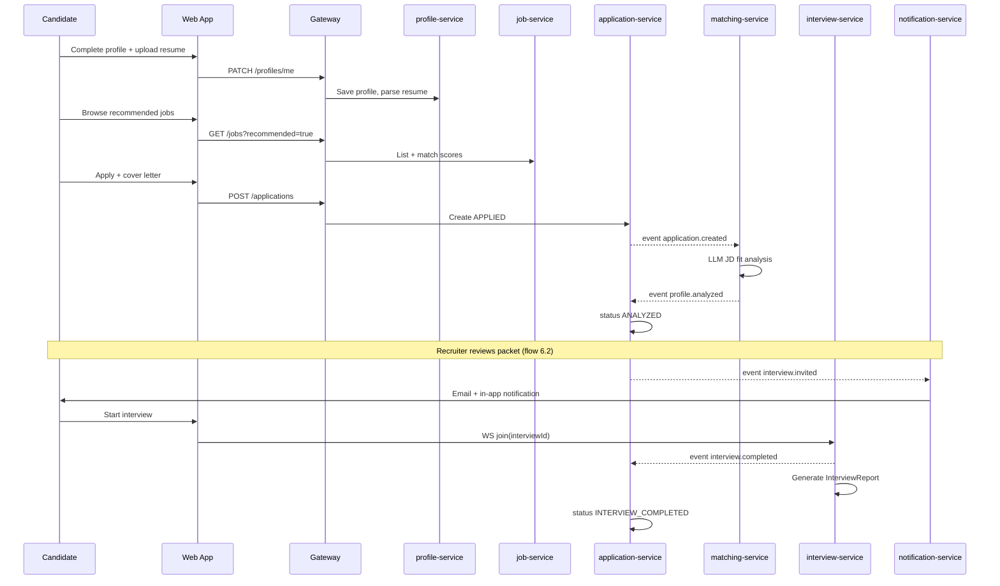
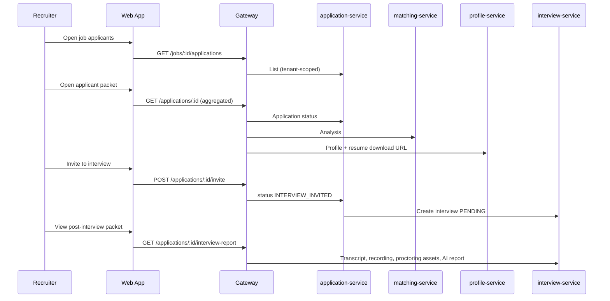

# AI Hiring Platform — Product & Engineering Plan

> **Status:** Living document  
> **Last updated:** 2026-07-06  
> **Purpose:** Single source of truth for incremental feature delivery. Reference this before starting any epic or service work.

---

## 1. Vision

Build a **multi-tenant AI hiring platform** where:

- **Candidates** maintain a rich profile, discover recommended jobs, apply with cover letters, complete proctored AI interviews, and track application analytics.
- **Recruiters** (per company/tenant) post jobs, review applicant packets (fit analysis, resume, links), shortlist candidates for interview, and receive AI-generated interview feedback with recordings and proctoring evidence.
- **The platform** orchestrates profile ↔ JD matching, interview scheduling, realtime AI interviews (existing engine), and post-interview analysis — as **independent microservices** connected by events.

### Personas

| Persona | Scope |
|---------|--------|
| **Candidate** | One user → one candidate profile → many applications across tenants |
| **Recruiter** | Belongs to exactly one **Company (tenant)** → manages jobs and applicants for that company only |
| **Company Admin** (future) | Manages recruiters, billing, branding within tenant |
| **Platform** (system) | AI services: JD generation, profile analysis, interview agent, post-interview report |

---

## 2. Requirements (from product expectations)

### 2.1 Candidate portal

#### R1 — Candidate profile (settings)

Each candidate has a dedicated profile portal to manage:

| Field group | Fields |
|-------------|--------|
| **Identity** | Name, email (from auth), phone, photo (optional) |
| **Skills** | Skill tags + proficiency (optional) |
| **Experience** | Work history entries (title, company, dates, description) |
| **Education** | Degree, institution, dates |
| **Preferences** | Desired salary (min/max/currency), desired positions/roles, location preferences (cities/regions/countries) |
| **Work style** | `REMOTE` \| `HYBRID` \| `ONSITE` |
| **Employment type** | `PERMANENT` \| `CONTRACT` \| `INTERNSHIP` (multi-select) |
| **Links** | LinkedIn, portfolio, GitHub, other URLs |
| **Resume** | Upload PDF/DOCX/TXT; parsed text stored; downloadable original |
| **Derived** | Auto-extracted resume fields (merge with manual edits) |

**Acceptance:** Candidate can save profile, re-upload resume, and see parsed preview. Profile persists across applications.

---

#### R2 — Job recommendations & listing

- Job listing page shows jobs **recommended for the candidate** based on profile (skills, preferences, location, salary overlap, employment type).
- Also supports browse/filter (location, salary, type, remote/hybrid/onsite, employment type).
- Non-recommended jobs still visible in full catalog with “match %” badge.

**Acceptance:** Logged-in candidate sees ranked job list with match score visible per job.

---

#### R3 — Job detail & apply

Each job listing displays:

- Title, company name (tenant), description, required skills, location, salary range, employment type, work style, expiry date, status (`OPEN` / `CLOSED`).

**Apply flow:**

1. Candidate clicks **Apply** on job detail.
2. Optional **cover letter** (textarea or upload).
3. Application created → triggers resume/JD analysis (async).
4. Redirect to **application analytics** screen (R8).

**Acceptance:** Apply disabled when job expired/closed or already applied. Cover letter stored with application.

---

#### R4 — Application → recruiter review packet

When candidate applies, recruiter sees an **applicant packet**:

| Section | Content |
|---------|---------|
| **Fit summary** | Match score vs JD, recommendation tier |
| **Skills** | Matching skills, missing skills |
| **Experience & education** | Structured from profile + resume |
| **Resume** | Full extracted text + **download original file** |
| **Links** | LinkedIn, portfolio, GitHub, etc. |
| **Cover letter** | As submitted |
| **Metadata** | Applied date, current status |

**Recruiter action:** If well fit (or manually), recruiter **shortlists / invites to interview** → interview scheduled → candidate notified (email + in-app).

**Acceptance:** Recruiter only sees applicants for their company’s jobs. Candidate cannot start interview until recruiter invites (or auto-invite rule if configured later).

---

#### R5 — Interview completion → recruiter feedback packet

After AI interview, recruiter receives:

| Artifact | Source |
|----------|--------|
| Full **transcript** | `interview-service` messages |
| **Proctoring monitoring images** | Snapshots during session (camera frames on violations or periodic) |
| **JD match score** | `matching-service` (pre-interview) |
| **Interview performance score** | `interview-service` + AI post-analysis |
| **AI narrative** | Strengths, gaps, overall recommendation |
| **Session recording** | Audio/video composite or audio + transcript sync |
| **Timeline** | Date applied, analysis completed, interview started/ended |
| **Status** | Application pipeline state |

**Acceptance:** Recruiter applicant detail page shows all artifacts in one view. Recording playable in browser.

---

### 2.2 Recruiter portal (multi-tenant)

#### R6 — Multi-tenancy (company isolation)

- Each **Company** is a tenant with isolated data: jobs, applications, recruiters, branding.
- Recruiter users belong to one `companyId`; all queries scoped by tenant.
- Candidates are **global** (one profile); applications link candidate to a company’s job.
- No cross-tenant data leakage in APIs or UI.

**Acceptance:** Recruiter A cannot list jobs or applicants from Company B.

---

#### R7 — Job creation & JD generation

Recruiter can create job listing with:

- Title, description (rich text), required skills, nice-to-have skills, location, salary min/max, currency, employment type, work style, expiry date, status (draft/open).

**AI assist:** “Auto-generate JD” from role title + seniority + industry standards → editable draft before publish.

**Acceptance:** Draft → publish flow. Expired jobs auto-close (cron or on-read check).

---

### 2.3 Candidate application analytics (R8)

After applying, candidate lands on **Application Analytics** for that application:

| Section | Content |
|---------|---------|
| **Actions** | **Start interview** (disabled until recruiter invites + notification sent); **Back to applications** |
| **Application overview** | Company, role, status, applied date |
| **Resume** | Uploaded file + link to profile resume |
| **Pipeline status** | Applied → Analyzed → Invited → Interview → Completed → Decision |
| **Analysis** | Date resume analyzed, match score, matching skills, missing skills, AI analysis text |
| **Interview** | Status (pending / invited / in progress / completed / cancelled), dates |
| **Post-interview** (if completed) | Ratings, overall feedback text, link to detailed results |

**Applications list page** (`/applications`): all applications with company, role, match score, applied date, status, link to job detail and analytics.

**Acceptance:** State transitions reflected in UI within seconds of backend events (poll or websocket).

---

### 2.4 Dashboards (R9)

#### Candidate dashboard (at a glance)

- Active applications count by status
- Pending interviews (invited, not started)
- Recommended jobs (top 5)
- Recent application activity
- Profile completeness indicator

#### Recruiter dashboard (at a glance)

- Open jobs count
- New applicants (last 7 days)
- Awaiting review / awaiting interview feedback
- Shortlist pipeline funnel
- Expiring jobs alert

**Acceptance:** Dashboard loads in &lt; 2s with aggregated API from gateway/BFF.

---

## 3. Application status pipeline

```
DRAFT_APPLICATION     (optional — save cover letter before submit)
        ↓
APPLIED               (submitted)
        ↓
ANALYZING             (matching-service running)
        ↓
ANALYZED              (match score ready — visible to candidate & recruiter)
        ↓
UNDER_REVIEW          (recruiter reviewing packet)
        ↓
INTERVIEW_INVITED       (recruiter shortlists — email + in-app notification)
        ↓
INTERVIEW_PENDING       (candidate may start)
        ↓
INTERVIEW_IN_PROGRESS   (WS session active)
        ↓
INTERVIEW_COMPLETED     (or INTERVIEW_CANCELLED on cheat/error)
        ↓
DECISION_PENDING        (AI post-interview report generating)
        ↓
SHORTLISTED | REJECTED | WITHDRAWN
```

| Status | Candidate can start interview? |
|--------|-------------------------------|
| Before `INTERVIEW_INVITED` | No |
| `INTERVIEW_INVITED` / `INTERVIEW_PENDING` | Yes |
| `INTERVIEW_IN_PROGRESS` | Resume or blocked |
| Terminal states | No |

---

## 4. Architecture — microservices map

Requirements map to **independently deployable services**. Each owns its database (schema per service in one Postgres instance for MVP).

```text
┌─────────────┐
│  apps/web   │  React — candidate + recruiter portals
└──────┬──────┘
       │
┌──────▼──────┐
│ api-gateway │  Auth, routing, aggregation, rate limits
└──────┬──────┘
       │
   ┌───┴───┬─────────┬──────────┬───────────┬────────────┬────────────┐
   ▼       ▼         ▼          ▼           ▼            ▼            ▼
identity  job    profile  application  matching   interview  notification
service   service service   service     service     service      service
   │       │         │          │           │            │            │
   └───────┴─────────┴──────────┴───────────┴────────────┴────────────┘
                              event bus (Redis Streams / NATS)
```

### Service responsibilities

| Service | Owns | Key APIs |
|---------|------|----------|
| **identity-service** | Users, roles, companies (tenants), recruiter membership, JWT | `/auth/*`, `/companies/*` |
| **job-service** | Job postings, JD storage, publish/expire, AI JD generation | `/jobs/*` |
| **profile-service** | Candidate profiles, resume parse/store, GitHub, preferences | `/profiles/*` |
| **application-service** | Applications, cover letters, status pipeline, recruiter decisions | `/applications/*` |
| **matching-service** | Profile ↔ JD analysis (skills, gaps, score) | `/analyses/*` |
| **interview-service** | Realtime AI interview, proctoring, transcript, recording, post-interview AI report | `/interviews/*`, `WS /interview/ws` |
| **notification-service** | Email + in-app notifications | consumes events |
| **media-service** (optional Phase 2) | Resume files, proctoring snapshots, interview recordings (S3-compatible) | `/media/*` |

### Shared packages

| Package | Purpose |
|---------|---------|
| `packages/api-types` | REST DTOs, WS protocol, event schemas |
| `packages/resume-parser` | PDF/DOCX extraction (from current backend) |
| `packages/event-bus` | Publisher/subscriber abstraction |
| `packages/service-clients` | Typed inter-service HTTP clients |

---

## 5. Data model (per service)

### identity-service

```text
Company          id, name, slug, logoUrl, createdAt
User             id, email, passwordHash, role (CANDIDATE|RECRUITER), companyId?, createdAt
RecruiterProfile userId, companyId, title, department
```

### profile-service

```text
CandidateProfile   userId (unique), skills[], experience[], education[]
                   preferences (salary, locations, roles, workStyle, employmentTypes[])
                   links (linkedin, portfolio, github, ...)
                   resumeFileId, resumeText, parsedResume (JSON), githubMeta (JSON)
                   profileCompleteness, updatedAt
```

### job-service

```text
Job              id, companyId, title, description, requiredSkills[], preferredSkills[]
                 location, salaryMin, salaryMax, currency, workStyle, employmentType
                 status (DRAFT|OPEN|CLOSED), expiresAt, createdBy, createdAt
```

### application-service

```text
Application      id, jobId, candidateUserId, profileId, companyId
                 coverLetter, status (enum), recruiterNotes
                 appliedAt, invitedAt, decidedAt
                 matchScore (denormalized cache), interviewId
```

### matching-service

```text
ProfileAnalysis  applicationId, fitScore, matchedSkills[], missingSkills[]
                 experienceAlignment, educationAlignment, aiSummary, recommendation
                 analyzedAt, modelVersion
```

### interview-service

```text
Interview        id, applicationId, status, score, startedAt, endedAt, endReason
Message          interviewId, participant, text, createdAt
ProctoringAsset  interviewId, type (snapshot|recording), storageUrl, capturedAt
InterviewReport  interviewId, strengths[], weaknesses[], overallRating, narrative, createdAt
```

---

## 6. Key user flows

### 6.1 Candidate — first time → apply → interview



### 6.2 Recruiter — review → invite → feedback



---

## 7. AI capabilities

| Feature | Service | Trigger | Output |
|---------|---------|---------|--------|
| Resume parsing | profile-service | Upload | Structured fields + raw text |
| Job recommendations | job-service + matching-service | Profile update / job list | Ranked jobs + match % |
| JD ↔ profile fit | matching-service | `application.created` | Score, skills, gaps, summary |
| JD auto-generation | job-service | Recruiter clicks generate | Draft JD from title + level |
| Live interview agent | interview-service | WS session | Realtime voice (existing) |
| Post-interview report | interview-service | `interview.completed` | Ratings, strengths, weaknesses, narrative |
| Proctoring | interview-service + frontend | During interview | Strikes, snapshots, termination |

### Interview agent context enrichment

Pass into OpenAI instructions (per application):

- Job description + required skills (from job-service)
- Candidate profile summary (from profile-service)
- Pre-interview match analysis highlights (from matching-service)

---

## 8. Frontend structure (apps/web)

```text
src/
  app/                    # Routes, layouts, auth guards
  features/
    auth/                 # Login, register (role selection)
    candidate/
      profile/            # R1 profile settings
      jobs/               # R2 listing + recommendations
      applications/       # R8 analytics + list
      dashboard/          # R9
    recruiter/
      jobs/               # R7 create/edit, JD generator
      applicants/         # R4 packet, invite action
      interview-review/   # R5 feedback packet
      dashboard/          # R9
    interview/            # Existing realtime room (reuse)
  shared/
```

### Route map

| Route | Feature |
|-------|---------|
| `/` | Landing / login |
| `/candidate/dashboard` | R9 |
| `/candidate/profile` | R1 |
| `/candidate/jobs` | R2 |
| `/candidate/jobs/:id` | R3 detail + apply |
| `/candidate/applications` | R8 list |
| `/candidate/applications/:id` | R8 analytics |
| `/interview/:id` | AI interview (existing) |
| `/recruiter/dashboard` | R9 |
| `/recruiter/jobs` | Job list |
| `/recruiter/jobs/new` | R7 create |
| `/recruiter/jobs/:id` | Edit + applicants |
| `/recruiter/applicants/:id` | R4 + R5 packet |

---

## 9. Events (event bus contract)

| Event | Publisher | Consumers |
|-------|-----------|-----------|
| `user.registered` | identity | notification (welcome) |
| `profile.updated` | profile | job-service (refresh recommendations cache) |
| `job.published` | job | notification (optional digest) |
| `application.created` | application | matching, notification |
| `profile.analyzed` | matching | application (status), notification |
| `application.invited` | application | interview (create), notification |
| `interview.completed` | interview | application, notification |
| `interview.cancelled` | interview | application, notification |
| `interview.report_ready` | interview | notification |
| `application.decided` | application | notification |

All events include: `eventId`, `correlationId`, `timestamp`, `tenantId` (companyId where applicable).

---

## 10. Multi-tenancy rules

1. Every recruiter-scoped DB query includes `companyId` from JWT.
2. Gateway enforces `companyId` on recruiter routes; candidates never receive other tenants’ applicant data.
3. Job listings for candidates are **public across tenants** (all companies post jobs); applicant data is not.
4. File storage paths: `{companyId}/applications/{applicationId}/...` for recruiter-visible assets.
5. Future: custom subdomain per company (`acme.platform.com`) — not in MVP.

---

## 11. Notifications

| Trigger | Channel | Recipient |
|---------|---------|-----------|
| Application submitted | In-app | Candidate |
| Analysis ready | In-app | Candidate |
| New applicant | In-app + email | Recruiter |
| Interview invited | Email + in-app | Candidate |
| Interview completed | In-app | Candidate + Recruiter |
| Decision (shortlist/reject) | Email + in-app | Candidate |

MVP: email via Resend/SendGrid; in-app via notification table + polling.

---

## 12. Media & recording

| Asset | Storage | Retention |
|-------|---------|-----------|
| Resume original | S3 / R2 / local MinIO | Life of application |
| Proctoring snapshots | Object storage | 90 days (configurable) |
| Interview audio/video | MinIO (`platform-media` bucket) | 90 days |
| Transcript | interview-service DB | Permanent |

**Phase 0:** MinIO client + bucket bootstrap wired.  
**Phase 6:** Browser video+audio capture → upload to MinIO; proctoring snapshots on warnings.

**Recording target:** Video + audio stored in MinIO (capture implemented Phase 6; storage client wired Phase 0).

---

## 13. Implementation phases

### Phase 0 — Foundation (current → platform base)

**Goal:** Monorepo ready for services; no user-facing change.

- [x] Add `packages/event-bus` (NATS), `packages/resume-parser`, `packages/object-storage` (MinIO)
- [x] Add `apps/gateway` (dedicated API gateway)
- [x] Add `docker-compose.yml` (Postgres, NATS, MinIO)
- [x] Extend `packages/api-types` with event schemas
- [x] Wire interview-service to NATS events + MinIO bootstrap
- [x] Add `plan.md`, `docs/PHASE0.md`
- [x] Run `bun install` + `docker compose up -d` (operator)
- [x] Optional: `./scripts/phase0-migrate-interview-service.sh` → `services/interview-service`

**Exit criteria:** Interview flow works via gateway (`localhost:8080`) with infra running.

**Runbook:** See [`docs/PHASE0.md`](./docs/PHASE0.md).

---

### Phase 1 — Identity & multi-tenancy

**Goal:** Login, companies, roles.

- [x] `identity-service`: User, Company, Recruiter, JWT auth
- [x] Register: candidate vs recruiter (recruiter joins/creates company)
- [x] Gateway: auth middleware, tenant context
- [x] Frontend: login/register, role-based redirect

**Exit criteria:** Recruiter sees empty dashboard scoped to company. Candidate sees empty profile prompt.

---

### Phase 2 — Candidate profile (R1)

**Goal:** Full profile portal.

- [x] `profile-service`: schema + CRUD for all R1 fields
- [x] Resume upload, parse, merge with manual fields
- [x] GitHub link enrichment (existing logic)
- [x] Profile completeness score
- [x] Frontend: `/candidate/profile`

**Exit criteria:** Candidate saves profile; resume downloadable; parsed text visible.

---

### Phase 3 — Jobs & recruiter posting (R6, R7)

**Goal:** Recruiters create jobs; candidates browse.

- [ ] `job-service`: CRUD, draft/publish, expiry
- [ ] AI JD generator endpoint
- [ ] Frontend: recruiter job create/edit
- [ ] Frontend: candidate job list (no recommendations yet)

**Exit criteria:** Recruiter publishes job; candidate sees it in catalog.

---

### Phase 4 — Apply & matching (R3, R4 partial)

**Goal:** Application + async analysis.

- [ ] `application-service`: apply with cover letter
- [ ] `matching-service`: LLM fit analysis on `application.created`
- [ ] Status pipeline through `ANALYZED`
- [ ] Frontend: job apply modal, application analytics (analysis section)
- [ ] Frontend: recruiter applicant list + packet (no interview yet)

**Exit criteria:** Apply → analysis visible to candidate and recruiter within ~30s.

---

### Phase 5 — Interview invite & scheduling (R4, R8)

**Goal:** Recruiter gates interview; candidate notified.

- [ ] Recruiter “Invite to interview” action
- [ ] `interview-service`: create interview linked to `applicationId`
- [ ] `notification-service`: email on invite
- [ ] Application status → `INTERVIEW_INVITED`
- [ ] Frontend: “Start interview” enabled only when invited
- [ ] Enrich interview agent prompt with JD + profile

**Exit criteria:** End-to-end apply → invite → AI interview → transcript stored.

---

### Phase 6 — Post-interview & recruiter feedback (R5)

**Goal:** Full recruiter feedback packet.

- [x] Post-interview AI report generation
- [x] Interview recording persistence
- [x] Proctoring snapshot capture (basic)
- [x] Frontend: recruiter interview review page
- [x] Frontend: candidate completed interview feedback on analytics

**Exit criteria:** Recruiter sees transcript, score, AI narrative, recording.

---

### Phase 7 — Recommendations & dashboards (R2, R9)

**Goal:** Personalized jobs + at-a-glance views.

- [ ] Job recommendation ranking (profile + match service)
- [ ] Candidate dashboard
- [ ] Recruiter dashboard
- [ ] Applications list page polish (R8)

**Exit criteria:** Dashboards match R9 acceptance; jobs ranked on listing.

---

### Phase 8 — Hardening & production

- [ ] OpenTelemetry tracing across services
- [ ] Idempotent event consumers + DLQ
- [ ] E2E tests for critical flows
- [ ] Rate limiting, file scan on upload
- [ ] Tenant audit log for recruiter actions

---

## 14. Migration from current codebase

| Current | Target |
|---------|--------|
| `apps/backend` | `services/interview-service` |
| `POST /pre-interview` | `POST /applications` (+ profile upsert) |
| `Form.tsx` at `/` | `/candidate/jobs/:id` apply flow |
| `Interview.tsx` | unchanged path; gated by application status |
| `Result.tsx` | split: candidate analytics + recruiter review |
| `sessionStorage` interview session | server-side application + profile APIs |
| Single Prisma schema | schema per service |

Keep `POST /pre-interview` as deprecated shim until Phase 5 complete.

---

## 15. Non-goals (MVP)

- Payments / billing per tenant
- SSO (SAML/OIDC) — custom JWT + Google/LinkedIn OAuth first (Phase 1)
- Candidate ↔ recruiter messaging chat
- Human live interview scheduling (calendar integrations)
- Mobile native apps
- White-label custom domains per tenant
- Multi-language UI

---

## 16. Platform decisions (resolved)

| # | Decision | Choice | Notes |
|---|----------|--------|-------|
| 1 | Event bus | **NATS** | `packages/event-bus`, JetStream-ready |
| 2 | Object storage | **MinIO** (dev) → S3 (prod) | `packages/object-storage` |
| 3 | Auth | **Custom JWT** + **Google/LinkedIn OAuth** | OAuth for candidate profile bootstrap (Phase 1) |
| 4 | API gateway | **Dedicated `apps/gateway`** | Frontend → `:8080` → services |
| 5 | Interview invite | **Manual** recruiter button | Auto-generated email → candidate analytics URL |
| 6 | Recording | **Video + audio** | MinIO storage; capture in Phase 6 |

---

## 17. Success metrics

| Metric | Target |
|--------|--------|
| Apply → analysis visible | &lt; 30s p95 |
| Interview WS connect | &lt; 3s |
| Recruiter packet load | &lt; 2s |
| Tenant isolation | 0 cross-tenant leaks in tests |
| Interview completion rate | Track; no target for MVP |

---

## 18. Reference links

- Architecture & trade-offs: `README.md`
- Shared types: `packages/api-types/src/index.ts`
- Current interview engine: `services/interview-service` (after Phase 0 migration)
- WebSocket protocol: `packages/api-types` → `ClientInterviewMessage`, `ServerInterviewEvent`

---

*Update this document when a phase completes or when open decisions are resolved.*
